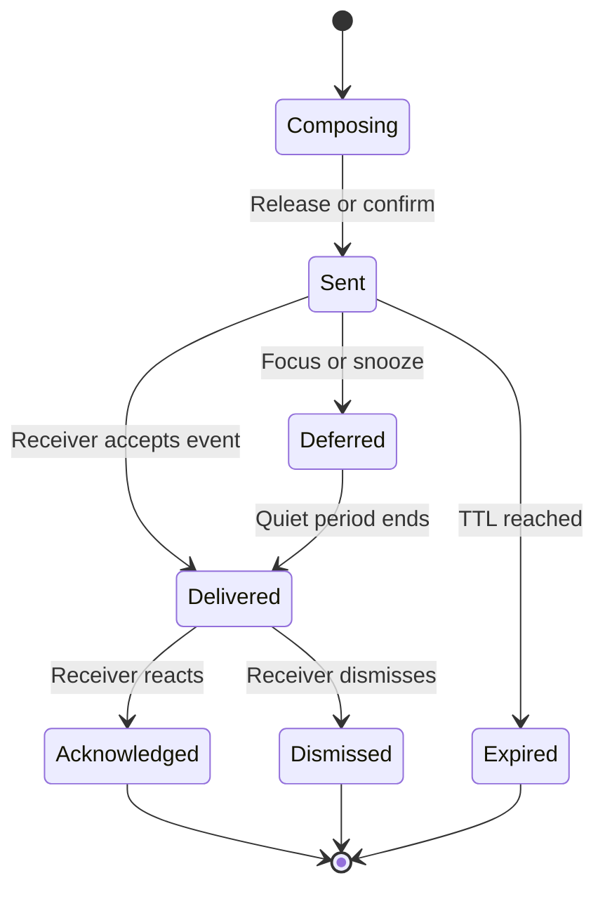
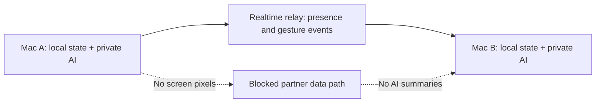
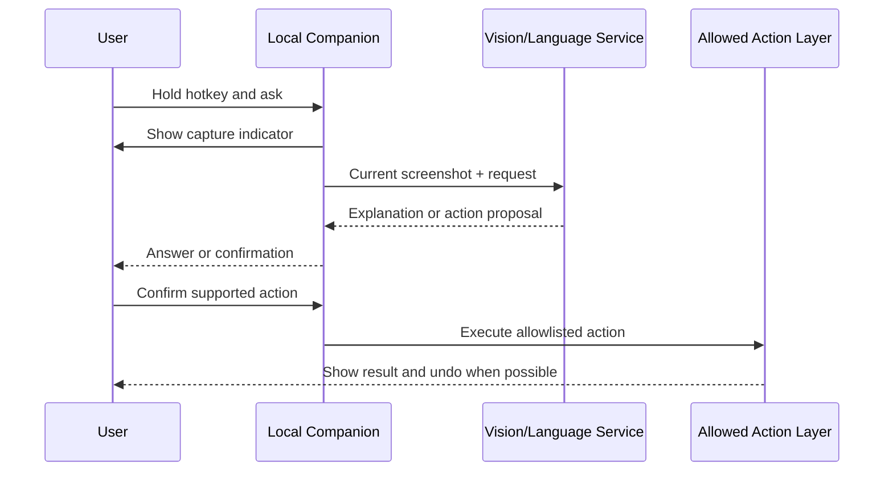
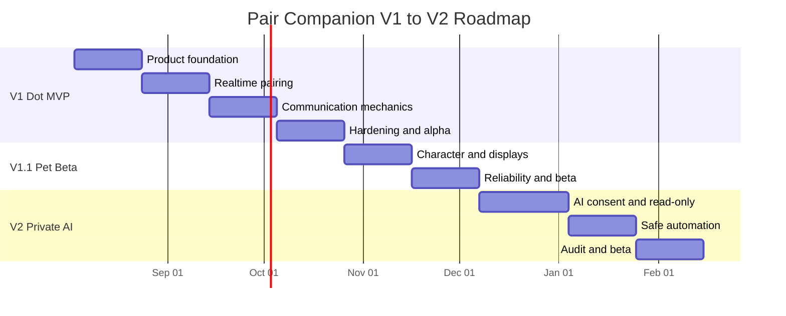

# Pair Companion for macOS
## Product Strategy, Delivery Roadmap, and Weekly Execution Tracker

**Document status:** Working product plan  
**Planning horizon:** V1 Dot MVP through V2 Private AI Companion  
**Platform:** macOS  
**Primary audience:** Product, design, macOS engineering, backend engineering, AI engineering, QA, and release owners  
**Last updated:** July 29, 2026  

---

## 1. Executive Summary

Pair Companion is a macOS-native ambient communication app for two paired people. Each person has a character that appears on both Macs. The character communicates presence, simple emotions, and intentional gestures without exposing either person's screen.

The product's strongest differentiator is not simply "a pet on the desktop." It is a low-friction shared presence layer that lives continuously on macOS:

- Both people can feel the other's presence without opening a chat app.
- A person's character reflects coarse system states such as active, away, sleeping, or unavailable.
- A person can send a deliberate emotion or gesture through the character.
- A person can move their own character on a privacy-safe proxy of the partner's display.
- The partner always retains control through mute, refusal, Focus-aware delivery, and rate limits.
- Screen pixels, window titles, app contents, and detailed activity history never cross to the partner.

The roadmap deliberately separates three technical systems that were mixed together in the original concept:

1. **Ambient presence:** a desktop overlay character synchronized between two Macs.
2. **Couples communication:** intentional gestures, movement, delivery, acknowledgment, and interruption controls.
3. **Private AI assistance:** an optional, on-demand, screen-aware assistant that remains local to the requesting user's experience and is introduced only in V2.

V1 uses a simple animated circle or dot instead of final character art. This keeps the early work focused on product behavior, networking, privacy, and reliability. The final pet art and richer animation system arrive after the interaction model has been validated.

### Recommended release sequence

| Release | Working name | Product outcome | Target window |
|---|---|---|---|
| V1.0 | Dot MVP | Two people can pair, see presence, send emotes, and move their own dot reliably and privately | Weeks 1-12 |
| V1.1 | Pet Beta | Replace the dot with an expressive character, add multi-display support, improve onboarding, and harden reliability | Weeks 13-18 |
| V2.0 | Private AI Companion | Add explicit, on-demand screen understanding and narrowly scoped automation without sharing screen context with the partner | Weeks 19-28 |

---

## 2. Product Vision

### Vision statement

Create the most natural way for two people to feel present on each other's Macs without demanding a conversation, opening a chat application, or exposing private screen content.

### Product thesis

A small animated character can make digital interruption feel more like affection than demand when:

- the message is emotionally expressive;
- the receiver remains in control;
- the interaction is lightweight and reversible;
- presence is ambient rather than invasive;
- acknowledgment is clear but not socially pressuring; and
- privacy boundaries are obvious and technically enforced.

### North-star behavior

At least once per active day, both paired users voluntarily interact with the shared companion and report that the interaction made them feel connected rather than interrupted.

### Product principles

1. **Connection before utility.** The primary job is emotional presence, not productivity automation.
2. **Receiver control.** The receiving user can always mute, defer, reject, or silence interactions.
3. **Privacy by architecture.** Screen contents never cross between partners. V2 AI context is private to the requesting user.
4. **Meaning before mechanics.** Every animation, position, and state must communicate something recognizable.
5. **Coarse presence, not surveillance.** Share broad states, never detailed app usage, timestamps, or behavioral history.
6. **Graceful silence.** Offline, muted, quit, network loss, and unavailable states do not reveal more than necessary.
7. **Reliable delight.** Animation is only charming if delivery, positioning, and presence are dependable.
8. **Progressive permissions.** The core couples experience should require no Screen Recording or Accessibility permission.
9. **Native macOS quality.** Overlay behavior, Spaces, full-screen apps, display scaling, signing, and updates are first-class requirements.
10. **Validate with the dot.** Final art must not hide a weak interaction model.

---

## 3. Product Definition

### Primary users

| Persona | Need | Current workaround | Product opportunity |
|---|---|---|---|
| Long-distance couple | Feel connected during the workday without constant texting | Messaging, video calls, mobile widgets | Persistent, gentle desktop presence |
| Couple working in separate rooms or locations | Signal affection or request attention without starting a conversation | Text, call, walk over | Expressive gesture with receiver control |
| Close friends or family pair | Share lightweight presence and emotions | Social apps and reactions | Private one-to-one ambient channel |
| Solo user in V2 | Get screen-aware help from a friendly character | Voice assistant, screenshots, manual search | Private, explicit, contextual assistance |

### Jobs to be done

#### Ambient job

> When my partner and I are using our Macs separately, help us feel present in each other's day without requiring a conversation.

#### Communication job

> When I want to express a small emotion or gently ask for attention, let me do it in a way that feels warm, clear, and easy to ignore or acknowledge.

#### Private assistance job

> When I am stuck on something visible on my Mac, let me explicitly ask my companion for help without sending that screen context to my partner.

### Product wedge

Mobile shared-pet products already exist. Pair Companion's defensible wedge is:

- macOS-native;
- continuously available as a desktop overlay;
- synchronized in real time;
- designed around ambient presence;
- privacy-safe by default; and
- capable of evolving into a private screen-aware assistant without compromising the couples channel.

---

## 4. Scope and Product Boundaries

### V1.0 Dot MVP includes

- macOS desktop application for exactly two paired users.
- One identity or character per person, mirrored on both screens.
- Simple circle or dot visual in place of final character art.
- Transparent floating overlay that can join Spaces and full-screen contexts.
- Local animated states.
- Pairing through a short-lived invite code.
- Real-time connection through a WebSocket relay.
- Coarse ambient presence derived from privacy-safe system signals.
- Server-derived unavailable state based on missed heartbeats.
- Ten deliberate emotional gestures.
- Privacy-safe partner-display proxy with no screen pixels.
- Normalized position synchronization.
- Receiver-side interpolation.
- Delivery and acknowledgment loop.
- Mute, temporary snooze, refuse, and Focus-aware suppression.
- No detailed interaction history.
- Signed and notarized direct distribution.
- Private alpha with one real pair.

### V1.1 Pet Beta includes

- Final or beta character art.
- Decision and implementation of Rive or sprite-sheet animation.
- Richer state transitions and emotional animations.
- Multi-display selection and topology mismatch handling.
- Improved onboarding and pairing recovery.
- Reconnect, offline resilience, and limited ephemeral queueing.
- Sparkle update flow.
- Privacy-respecting opt-in diagnostics.
- Expanded beta cohort.

### V2.0 Private AI Companion includes

- On-demand screen capture only after an explicit user action.
- Push-to-talk or deliberate hotkey interaction.
- Screen understanding for questions about the current screen.
- Temporary local/session context with clear reset controls.
- Optional microphone permission.
- Optional Screen Recording permission.
- Optional Accessibility permission only for supported automation.
- UI-element pointing or highlighting.
- Narrow allowlist of reversible automation tasks.
- Confirmation before consequential actions.
- Cost, latency, safety, and privacy controls.
- Strict isolation from partner-visible data and events.

### Explicit non-goals

- Continuous screenshot streaming.
- Partner access to screenshots, app names, window titles, typed content, or AI summaries.
- Remote desktop control.
- General-purpose surveillance or productivity monitoring.
- More than two paired users before V2 is stable.
- Public social network, feed, followers, or discovery.
- WebRTC peer-to-peer networking in V1.
- Mac App Store distribution for the initial releases.
- Full AI agent functionality in V1.
- Detailed presence history or "last seen at" timestamps.
- Final character art before the core mechanics are validated.

---

## 5. Decision Register

This register separates confirmed direction, roadmap assumptions, and decisions that require validation.

### Confirmed product direction

| ID | Decision | Rationale |
|---|---|---|
| D-01 | macOS-only for initial releases | The desktop overlay is the primary differentiation |
| D-02 | Two paired users | Keeps trust, identity, and networking models intentionally narrow |
| D-03 | Ambient presence is a core feature | System state gives the character ongoing emotional value |
| D-04 | Sender uses a proxy of the partner's display geometry | Makes position geometrically meaningful without sharing screen content |
| D-05 | Receiver can mute or refuse | A relationship product cannot force interruption |
| D-06 | V1 focuses on animation and communication | Avoids combining the hardest AI work with unvalidated social mechanics |
| D-07 | Start with a simple circle or dot | Validates behavior before investing in art |
| D-08 | Partner never receives screen contents | Establishes the central privacy boundary |

### Roadmap assumptions adopted for planning

| ID | Assumption | Product effect | Validation point |
|---|---|---|---|
| A-01 | One character per person is mirrored on both screens | Removes the hidden-character mental model | Prototype test in Week 2 |
| A-02 | A user controls only their own character | Eliminates simultaneous ownership conflict | Networking contract review in Week 4 |
| A-03 | Focus is an interruption policy, not a shared presence state | Avoids exposing private Focus mode names | Privacy review in Week 9 |
| A-04 | V1 has four partner-visible presence states | Keeps state legible and coarse | State comprehension test in Week 3 |
| A-05 | No history or exact timestamps are stored by default | Prevents the app from becoming a monitoring tool | Threat model in Week 10 |
| A-06 | All silent conditions appear as one unavailable state to the partner | Does not reveal whether the user muted, quit, lost Wi-Fi, or went offline | Pair interview in Week 10 |
| A-07 | WebSocket relay is used instead of WebRTC | Reduces NAT traversal and connection complexity | Architecture review in Week 4 |
| A-08 | Native animation is used for the dot | Minimizes dependencies during V1 | Performance review in Week 2 |
| A-09 | Rive and sprite sheets are compared before final character implementation | Avoids premature animation lock-in | Decision gate in Week 13 |
| A-10 | V2 AI remains a private module inside the product | Preserves one app while maintaining a hard data boundary | V2 architecture review in Week 19 |
| A-11 | AI capture is explicit, not continuous | Controls privacy, cost, and user trust | V2 consent test in Week 20 |
| A-12 | Distribution uses Developer ID, notarization, and Sparkle | Supports non-App-Store capabilities and controlled updates | Release spike in Week 1 |

### Open decisions with owners and deadlines

| ID | Decision required | Options | Recommended starting point | Owner | Decide by |
|---|---|---|---|---|---|
| O-01 | Final animation runtime | Rive / sprite sheets / custom Core Animation | Run a measured Rive vs. sprite-sheet spike | Animation Engineer | Week 13 |
| O-02 | Backend hosting | Managed realtime service / custom WebSocket service | Small custom relay with managed database and secrets | Backend Engineer | Week 4 |
| O-03 | Account model | Email / Sign in with Apple / device-first | Sign in with Apple plus device key | Product + Backend | Week 5 |
| O-04 | First target display | Primary / active / last selected | Primary in V1; explicit selection in V1.1 | Product + macOS | Week 7 |
| O-05 | Acknowledgment language | Delivered / seen / explicit reaction | Delivered plus optional tap acknowledgment | Product Design | Week 8 |
| O-06 | Diagnostic telemetry | None / local export / opt-in aggregate | Local diagnostics plus explicit opt-in aggregate metrics | Privacy + QA | Week 10 |
| O-07 | AI model deployment | Cloud / on-device / hybrid | Provider abstraction with explicit cloud disclosure | AI Engineer | Week 19 |
| O-08 | Automation scope | Read-only / reversible actions / broad control | Read-only plus a small reversible allowlist | Product + Security | Week 23 |

---

## 6. Core Experience Model

### Character model

Each person owns one character:

- **My character** appears locally and on my partner's Mac.
- **Partner's character** appears locally and on their Mac.
- I may move or animate my own character.
- I may not directly control my partner's character.
- The server validates ownership on every state, movement, and gesture event.

This model removes the need for one visible and one hidden character. Both characters are meaningful and visible, while local controls remain easy to understand.

### Presence state model

Focus modes do not become partner-visible labels. They only control whether inbound gestures are delivered immediately, quietly deferred, or suppressed.

| Visible state | Entry conditions | Exit conditions | Minimum dwell / hysteresis | Partner presentation |
|---|---|---|---|---|
| Active | Mac awake and unlocked; recent local input below idle threshold; heartbeat healthy | Idle threshold exceeded, system sleeps/locks, app loses connection | 30 seconds before showing Active after another state | Dot awake and gently moving |
| Away | Mac awake but input idle exceeds threshold | Input resumes, Mac sleeps/locks, heartbeat expires | Enter after 5 minutes idle; remain at least 60 seconds | Dot resting or looking away |
| Sleeping | System sleep or display sleep event observed | Wake event plus healthy heartbeat | Enter immediately; exit after 15 seconds stable wake | Dot sleeping |
| Unavailable | Missed server heartbeats, app quit, network unavailable, user muted presence, or account disconnected | Stable connection and eligible state returns | Enter after heartbeat grace period; exit after 30 seconds stable connection | Neutral absence treatment; no reason disclosed |

### Sensor policy

V1 uses a zero- or low-permission sensor stack:

- system sleep and wake notifications;
- session lock and unlock notifications;
- idle duration;
- connection heartbeats; and
- optionally a locally mapped coarse activity category if it can be implemented without exposing an app name.

V1 must not collect:

- screen images;
- window titles;
- document names;
- keystrokes;
- clipboard contents;
- browsing history;
- exact app history; or
- exact presence timestamps visible to the partner.

### Deliberate emotional vocabulary

The dot must communicate the same semantic vocabulary that the later character will use.

| ID | User intent | V1 dot expression | Future pet expression | Receiver action |
|---|---|---|---|---|
| E-01 | Thinking of you | Soft pulse toward partner's dot | Gentle wave or glance | Acknowledge or ignore |
| E-02 | Love | Heart-colored double pulse | Heart animation | Send back |
| E-03 | Hug | Dot expands around partner's dot | Short hug animation | Accept, return, or defer |
| E-04 | Celebrate | Bright bounce and particles | Jump or confetti | React |
| E-05 | I miss you | Slow approach and pause | Walk in and sit nearby | Acknowledge |
| E-06 | Check in | Two small taps | Curious look or knock | "I'm okay" quick response |
| E-07 | Support | Warm steady glow | Sit beside partner | Acknowledge |
| E-08 | Play | Side-to-side bounce | Playful dance | Join or dismiss |
| E-09 | Quiet company | Move nearby without notification sound | Sit quietly | No response required |
| E-10 | Please look when free | Center arrival with a restrained badge | Walk to attention anchor | Acknowledge, snooze, or dismiss |

**Safety note:** V1 does not include an "urgent emergency" gesture. The app must not create a false expectation of emergency delivery. Genuine emergencies should use calls or emergency services.

### Gesture lifecycle



### Acknowledgment policy

- The sender sees **Sent**, **Delivered**, **Deferred**, **Acknowledged**, or **Expired**.
- No exact read timestamp is shown.
- "Delivered" means the receiving client accepted the event, not that the person looked at it.
- "Acknowledged" requires an explicit receiver action.
- Ignored or dismissed events do not shame the receiver.
- Receipts are ephemeral and removed after the current interaction session.

### Interruption controls

| Control | Behavior | Visibility to partner |
|---|---|---|
| Mute gestures | Suppresses deliberate inbound animations | Partner sees only deferred or unavailable, not "muted by you" |
| Snooze | Silences gestures for a selected period | No reason shared |
| Focus-aware delivery | Defers non-priority gestures while configured Focus is active | Partner sees Deferred |
| Presentation mode | Hides overlay and suppresses gestures | No presentation status shared |
| Quiet hours | Defers gestures during user-defined hours | No schedule shared |
| Block/unpair | Immediately stops all shared communication | Pair relationship ends |
| Rate limit | Prevents repeated gestures from becoming harassment | Sender gets a neutral cooldown message |

### Rate and abuse limits

- Maximum of 5 deliberate gestures per rolling 10-minute window by default.
- Repeated identical gestures collapse into one active animation.
- Position updates are accepted only during an active drag session.
- A drag session expires after 15 seconds of inactivity.
- Deferred gestures have a short time-to-live and do not form an unbounded queue.
- The receiver can permanently disable position arrivals while retaining ambient presence.

---

## 7. Positioning and Multi-Display Requirements

### Why a display proxy is required

A coordinate has no meaning if the sender cannot see the geometry of the receiving display. The sender therefore aims on a blank proxy rectangle representing only:

- display aspect ratio;
- logical width and height;
- display count;
- primary-display designation; and
- optional safe-area insets.

The proxy never contains:

- screenshots;
- wallpaper;
- application windows;
- dock contents;
- menu bar contents; or
- cursor position.

### Position data contract

Transmit:

- pair ID;
- sender character ID;
- target display ID represented by a rotating, non-identifying session token;
- normalized `x` and `y` values in the range `[0,1]`;
- anchor or free-position mode;
- drag session ID;
- monotonically increasing sequence number; and
- short event timestamp used only for ordering and expiry.

Do not transmit:

- raw screenshots;
- absolute pixel coordinates as the canonical position;
- app or window metadata; or
- persistent display serial numbers.

### V1 display policy

- Support one primary display.
- Normalize coordinates to the visible frame.
- Clamp coordinates to keep the complete dot onscreen.
- Snap to safe anchors near menu bar, dock, and corners.
- Convert between AppKit and Core Graphics coordinate origins in one tested geometry module.
- Interpolate receiver movement at 60 fps from position events received at approximately 20-30 Hz.

### V1.1 display policy

- Sync multiple display geometries.
- Let the sender choose a target display through geometry-only thumbnails.
- If a target display disappears, move to the receiver's primary display.
- If topologies do not match, preserve the normalized location within the selected target display.
- Support explicit mismatch policies: clamp, snap-to-nearest-anchor, or primary-display fallback.
- Persist the receiver's selected default display locally.

### Ownership and conflict policy

- Each user is the authoritative writer for their own character.
- The backend rejects movement events from a non-owner.
- If the same account is active on multiple Macs, the most recently granted movement lease is authoritative.
- Sequence numbers discard stale packets.
- Server time is not used to decide character ownership.
- A receiver may locally pin or hide the partner's character; this does not move the sender's canonical position.

---

## 8. Privacy and Trust Architecture

### Hard privacy boundary



### Data classification

| Class | Examples | Partner access | Server handling | Default retention |
|---|---|---|---|---|
| Shared presence | Active, away, sleeping, unavailable | Yes, coarse only | Relay current state | Current state only |
| Shared communication | Emote ID, movement, acknowledgment | Yes | Relay and short TTL | Ephemeral |
| Display geometry | Aspect ratio, logical dimensions, display count | Yes | Relay while paired | Session or short cache |
| Account and pairing | User ID, pair ID, device public key | No direct display | Required for authentication | While account/pair exists |
| Local private context | Screenshot, window interpretation, voice input | Never | V2 only; process according to explicit consent | No screenshot retention by default |
| Diagnostics | Crash logs, performance counters | Never | Opt-in or local export | Time-limited |

### Trust requirements

- Network payload inspection tests must prove that screen pixels and app content are absent from partner-bound events.
- V2 AI summaries must not be reused as couples communication content without a separate, explicit compose-and-confirm step.
- Permission prompts must be contextual and explain the immediate benefit.
- The app remains useful without Screen Recording, Microphone, or Accessibility permissions.
- Revoking a permission must degrade gracefully.
- Unpairing revokes session tokens and deletes active pair state.
- Secrets are stored in Keychain.
- All network traffic uses modern TLS.
- Server authorization checks pair membership and character ownership on every write.

### Threats to test

| Threat | Example | Mitigation | Owner |
|---|---|---|---|
| Unauthorized pair access | Guessed invite code | Short expiry, attempt limits, one-time use | Backend |
| Screen data leakage | Screenshot accidentally included in event payload | Separate data types, network tests, code review gate | Security + AI |
| Gesture spam | Repeated attention requests | Rate limit, collapse, mute, report/unpair | Product + Backend |
| Presence inference | Exact behavioral tracking | Coarse state, hysteresis, no history, no timestamps | Product + Privacy |
| Stale movement | Delayed packets teleport character | Session ID, sequence numbers, TTL | Backend + macOS |
| Offscreen placement | Display topology changes | Clamp and fallback policy | macOS |
| Permission confusion | User thinks partner can see screen | Explicit onboarding and persistent privacy indicator | Design |
| Compromised update | Malicious update package | Signed releases and signed update feed | Release |
| AI overreach | Automation performs unexpected action | Allowlist, confirmation, reversible operations, audit tests | AI + Security |

---

## 9. Technical Product Architecture

### V1 logical components

| Component | Responsibility | Primary owner |
|---|---|---|
| Overlay shell | Transparent window, hit testing, Spaces, full-screen behavior | macOS Engineer |
| Dot renderer | Idle and gesture animation, interpolation | macOS + Animation |
| Local presence engine | Sleep, wake, lock, idle, hysteresis | macOS Engineer |
| Interaction controller | Drag, emote picker, acknowledgment, mute | macOS Engineer |
| Pairing service | Invite codes, accounts, device identity, pair membership | Backend Engineer |
| Realtime relay | Presence, gesture, position, and receipt delivery | Backend Engineer |
| State store | Current pair/device state and short-lived event state | Backend Engineer |
| Privacy layer | Event allowlist, payload validation, logging policy | Security/Privacy Owner |
| Update and release | Signing, notarization, packaging, Sparkle | Release Engineer |
| QA harness | Loopback simulator, network fault injection, display matrix | QA Engineer |

### Recommended V1 event types

| Event | Direction | Required fields | TTL |
|---|---|---|---|
| `presence.updated` | Client to server to partner | pair, actor, coarse state, sequence | Replace current |
| `heartbeat` | Client to server | device, session, sequence | Seconds |
| `display.geometry` | Client to server to partner | session display tokens, bounds, scale metadata | Session |
| `drag.started` | Client to server to partner | character, drag session, target display | 15 seconds |
| `position.updated` | Client to server to partner | drag session, normalized x/y, sequence | 2 seconds |
| `drag.ended` | Client to server to partner | drag session, final position | Short |
| `emote.sent` | Client to server to partner | gesture ID, request ID, TTL | Minutes |
| `emote.delivered` | Receiver to server to sender | request ID, status | Session |
| `emote.acknowledged` | Receiver to server to sender | request ID, reaction | Session |
| `pair.revoked` | Server to both | pair and revocation reason category | Immediate |

### Networking guidance

- Use loopback and simulated network conditions before testing two physical Macs.
- Coalesce movement events; do not persist every coordinate.
- Interpolate client-side rather than increasing network frequency.
- Treat reconnection as a state reconciliation problem, not an event replay problem.
- On reconnect, request the latest canonical state and discard expired events.
- Use a small ephemeral queue only for eligible gestures.
- Never queue live drag position packets.

### macOS overlay requirements

- Non-activating transparent panel.
- Floating window level appropriate for desktop presence.
- Join all Spaces.
- Support full-screen auxiliary behavior.
- Click-through outside the character's hit region.
- Drag capture only while the user is interacting with their own character.
- No accidental focus stealing.
- Respect Reduce Motion.
- Respect accessibility contrast and size preferences.
- Provide a menu-bar escape hatch to hide, mute, open settings, and quit.

### Distribution requirements

- Create a real signed `.app` early because macOS permissions and identity are tied to the bundle.
- Use a stable bundle identifier and installation path.
- Use Developer ID signing and notarization.
- Package a DMG for external distribution.
- Use a signed Sparkle appcast for updates in V1.1.
- Maintain a reproducible release checklist and rollback procedure.
- Do not plan the first release around Mac App Store review.

---

## 10. V2 Private AI Companion Architecture

### Product boundary

The AI companion may understand the requesting user's current screen only when that user explicitly invokes it. Its observations do not enter partner-visible presence, movement, gesture, or acknowledgment events.

### V2 interaction sequence



### V2 AI requirements

- Capture occurs only during an explicit invocation.
- A visible indicator appears while capture or microphone input is active.
- Screenshots are not stored by default.
- Session summaries are optional, inspectable, and clearable.
- The user can disable cloud processing and understand resulting limitations.
- Partner events cannot reference private AI context automatically.
- AI-generated partner messages require a compose preview and explicit send.
- Automation is allowlisted.
- Destructive, financial, credential, permission, or external communication actions require confirmation or remain unsupported.
- Accessibility permission is requested only when the user invokes a feature that needs it.
- The model provider is abstracted to support cost and privacy changes.
- Cost controls include image resizing, invocation limits, caching only non-sensitive local metadata, and no continuous polling.

### V2 initial supported tasks

| Priority | Task | Mode | Confirmation |
|---|---|---|---|
| P0 | Explain what is visible on the current screen | Read-only | No |
| P0 | Point to a described UI element | Read-only overlay | No |
| P0 | Summarize an error message | Read-only | No |
| P1 | Suggest the next manual step | Read-only | No |
| P1 | Open an explicitly named local app | Reversible action | Yes on first use |
| P1 | Navigate to a known settings pane | Reversible action | Yes |
| P2 | Fill a non-sensitive local field | Controlled action | Always |
| Excluded | Send messages, submit purchases, enter credentials, or delete data | Unsupported initially | Not applicable |

---

## 11. Team Model and Ownership

Replace the role labels with names during kickoff. One person may hold multiple roles on a small team, but every work item must still have exactly one directly responsible owner.

### Suggested team

| Label | Role | Primary responsibilities |
|---|---|---|
| TM-A | Product Manager / Product Designer | Requirements, user testing, prioritization, interaction design, metrics |
| TM-B | macOS Engineer | Overlay, state engine, interaction, coordinate system, local privacy |
| TM-C | Backend / Realtime Engineer | Pairing, auth, WebSocket relay, state, rate limits |
| TM-D | Animation / UX Engineer | Dot behavior, motion system, character pipeline, accessibility |
| TM-E | QA / Release / Security Engineer | Test automation, privacy verification, signing, notarization, updates |
| TM-F | AI Engineer, V2 | Screen capture workflow, model integration, action allowlist, AI safety |

### RACI overview

| Workstream | Accountable | Responsible | Consulted | Informed |
|---|---|---|---|---|
| Product scope and acceptance | TM-A | TM-A | TM-B, TM-C, TM-D, TM-E | Entire team |
| Overlay and macOS behavior | TM-B | TM-B | TM-D, TM-E | TM-A |
| Realtime and pairing | TM-C | TM-C | TM-B, TM-E | TM-A |
| Motion and character system | TM-D | TM-D | TM-A, TM-B | Entire team |
| Privacy and security | TM-E | TM-E, TM-C | TM-A, TM-B, TM-F | Entire team |
| Release engineering | TM-E | TM-E | TM-B, TM-C | TM-A |
| AI architecture and delivery | TM-F | TM-F | TM-A, TM-B, TM-E | Entire team |

### Working agreements

- One owner per ticket.
- Acceptance criteria are written before implementation begins.
- Privacy-sensitive features require review by TM-E.
- User-visible behavior requires a short screen recording or reproducible demo in the ticket.
- "Almost done" is not a status. Use Not Started, Ready, In Progress, Blocked, In Review, Validation, or Done.
- A blocked ticket names the blocker, owner, and next decision date.
- A milestone is complete only after its exit criteria pass.

---

## 12. Delivery Roadmap

### Roadmap overview



Dates are illustrative and should be rebased at kickoff. Weekly sequence and dependencies are authoritative.

---

## 13. Detailed Weekly Plan

### Week 0 - Product kickoff and baseline

**Objective:** Convert the concept into an executable backlog and establish product, privacy, and technical baselines.

| Work item | Owner | Deliverable | Acceptance criteria |
|---|---|---|---|
| Confirm vision, scope, and non-goals | TM-A | Approved one-page charter | Team signs off on V1, V1.1, and V2 boundaries |
| Assign team names to role labels | TM-A | Ownership map | Every epic has one accountable owner |
| Finalize four-state presence table | TM-A + TM-B | State specification | Entry, exit, dwell, and visible treatment defined |
| Define event and privacy allowlists | TM-C + TM-E | Data contract draft | Every outbound field classified |
| Create issue tracker | TM-A | Epics, milestones, labels, templates | All Week 1-3 work is Ready |
| Establish repository and CI | TM-B + TM-C + TM-E | Build/test pipeline | Clean build and unit test run on pull request |
| Acquire release prerequisites | TM-E | Apple Developer and signing checklist | Required accounts and certificates identified |

**Exit gate M0:** Scope, owners, state model, event boundaries, and delivery workflow are approved.

### Week 1 - Native overlay technical spike

**Objective:** Prove the macOS overlay can behave correctly before building product logic.

| Work item | Owner | Deliverable | Acceptance criteria |
|---|---|---|---|
| Create signed app shell with stable bundle ID | TM-B + TM-E | Installable development app | Rebuild retains app identity |
| Implement transparent non-activating panel | TM-B | Overlay prototype | Does not steal focus |
| Join Spaces and full-screen environments | TM-B | Window behavior demo | Passes desktop, Space, and full-screen test matrix |
| Implement hit-test region | TM-B | Click-through overlay | Clicks outside dot reach underlying app |
| Add menu-bar controls | TM-B | Hide, show, settings, quit | User can always escape overlay |
| Release-path spike | TM-E | Signing/notarization risk note | Known blockers documented |

**Exit gate:** A dot can float reliably without disrupting normal Mac use.

### Week 2 - Dot renderer and local interaction

**Objective:** Establish the placeholder interaction system that will survive into the final character.

| Work item | Owner | Deliverable | Acceptance criteria |
|---|---|---|---|
| Implement native animated dot | TM-D + TM-B | Idle dot animation | Smooth at target frame rate |
| Render two identity-distinct dots | TM-D | Local and partner styles | Users identify ownership in under 2 seconds |
| Implement own-dot dragging | TM-B | Local drag interaction | Only the owned dot can be dragged |
| Add safe onscreen bounds | TM-B | Clamp behavior | Dot cannot be lost offscreen |
| Add Reduce Motion behavior | TM-D | Accessible motion mode | All essential meaning remains legible |
| Test one-pet-per-person mental model | TM-A | 3-5 usability sessions | At least 80% correctly explain ownership without coaching |

**Exit gate:** The two-character model is understandable and locally usable.

### Week 3 - Ambient presence state engine

**Objective:** Make the dot feel alive through privacy-safe local state.

| Work item | Owner | Deliverable | Acceptance criteria |
|---|---|---|---|
| Implement sleep/wake and lock/unlock inputs | TM-B | Local sensor module | State transitions pass deterministic tests |
| Implement idle detection | TM-B | Away-state logic | Threshold is configurable |
| Add hysteresis and dwell times | TM-B | Stable state machine | No rapid state flapping in test scenarios |
| Map states to dot animations | TM-D | Four visual states | Users identify at least 3 of 4 states correctly |
| Verify permission footprint | TM-E | Permission audit | Core state engine uses no Screen Recording or Accessibility |
| Run battery/CPU baseline | TM-E | Performance report | Meets provisional resource budget or creates action items |

**Exit gate M1:** Local ambient companion works with a stable, comprehensible state model.

### Week 4 - Realtime foundation and loopback simulation

**Objective:** Prove event delivery before introducing accounts and two physical Macs.

| Work item | Owner | Deliverable | Acceptance criteria |
|---|---|---|---|
| Finalize backend choice | TM-C | Architecture decision record | Cost, scaling, and operational tradeoffs documented |
| Build authenticated WebSocket relay skeleton | TM-C | Realtime service | Two simulated clients exchange allowlisted events |
| Define versioned event schema | TM-C + TM-B | Shared schema package | Unknown fields/events are safely rejected |
| Build loopback pair simulator | TM-E + TM-C | Test harness | Simulates both users on one machine |
| Add latency and packet-loss injection | TM-E | Network test controls | Can reproduce delay, drop, reorder, and reconnect |
| Add ownership validation | TM-C | Server authorization | Non-owner movement is rejected |

**Exit gate:** Realtime core works under simulated adverse conditions.

### Week 5 - Authentication, pairing, and device identity

**Objective:** Allow exactly two users to establish a safe pair relationship.

| Work item | Owner | Deliverable | Acceptance criteria |
|---|---|---|---|
| Confirm account method | TM-A + TM-C | Decision record | Recovery and privacy considered |
| Implement device key storage | TM-B + TM-C | Keychain-backed identity | Secret material never stored in plain text |
| Implement short-lived invite code | TM-C | Pairing API | One-time, expiring, rate-limited code |
| Build pairing UI | TM-A + TM-B | Send/join flow | New user completes pairing in under 3 minutes in test |
| Implement unpair and token revocation | TM-C + TM-B | Unpair flow | Both clients lose pair access immediately |
| Add pairing abuse tests | TM-E | Security tests | Guessing and reuse controls pass |

**Exit gate M2:** Two real Macs can pair and revoke the relationship safely.

### Week 6 - Presence synchronization and resilience

**Objective:** Synchronize coarse presence while preserving ambiguity around silence.

| Work item | Owner | Deliverable | Acceptance criteria |
|---|---|---|---|
| Send coarse presence updates | TM-B + TM-C | Presence sync | Partner state changes within target latency |
| Add heartbeat protocol | TM-C | Connection health | Missed heartbeats produce Unavailable |
| Collapse silent reasons | TM-C + TM-A | Privacy-safe mapping | Partner cannot distinguish quit, mute, or connection loss |
| Add reconnect reconciliation | TM-C + TM-B | State recovery | Latest state replaces stale state after reconnect |
| Test sleep and network-loss paths | TM-E | Failure matrix | No stuck Active state after client disappears |
| Conduct trust-language test | TM-A | Copy revisions | Users understand what is and is not shared |

**Exit gate:** Presence is reliable enough for daily background use.

### Week 7 - Display proxy and position protocol

**Objective:** Make remote positioning geometrically honest and privacy-safe.

| Work item | Owner | Deliverable | Acceptance criteria |
|---|---|---|---|
| Build local display geometry module | TM-B | Normalization library | Unit tests cover origin, scaling, dock, and menu bar |
| Sync geometry-only metadata | TM-B + TM-C | Display event | Network inspection confirms no pixels or window data |
| Design proxy rectangle | TM-A + TM-D | Position composer | Sender understands that proxy has no screen contents |
| Implement normalized final position | TM-B + TM-C | Cross-device positioning | Error remains within 2% of target display diagonal |
| Add clamp and safe anchors | TM-B | Fallback behavior | Dot always remains fully visible |
| Test differing aspect ratios | TM-E | Geometry matrix | Expected mapping documented and verified |

**Exit gate:** A sender can intentionally place their dot on the partner's primary display.

### Week 8 - Live drag sync and interpolation

**Objective:** Make movement feel direct without creating excessive network traffic.

| Work item | Owner | Deliverable | Acceptance criteria |
|---|---|---|---|
| Implement drag session lease | TM-C + TM-B | Start/update/end protocol | Stale sessions expire |
| Stream coalesced position updates | TM-B | Approximately 20-30 Hz events | Network budget is met |
| Add sequence handling | TM-C + TM-B | Ordering logic | Old packets never overwrite newer positions |
| Implement receiver interpolation | TM-D + TM-B | Smooth movement | No visible teleporting under target network profile |
| Add drag cancellation | TM-B | Recovery behavior | Disconnect or escape restores stable position |
| Validate full-screen and Space movement | TM-E | Interaction test report | No lost focus or inaccessible dot |

**Exit gate M3:** Real-time movement is smooth, bounded, and ownership-safe.

### Week 9 - Emotional vocabulary and acknowledgment

**Objective:** Transform movement from a technical channel into a meaningful communication system.

| Work item | Owner | Deliverable | Acceptance criteria |
|---|---|---|---|
| Finalize ten emote labels and copy | TM-A | Vocabulary specification | Each emote has one clear primary meaning |
| Implement V1 dot animations | TM-D | Ten expressions | At least 8 of 10 meet comprehension target |
| Build emote composer | TM-A + TM-B | Selection UI | Common emote sent in two interactions or fewer |
| Implement delivery states | TM-C + TM-B | Sent/delivered/deferred/expired | State accurately matches client lifecycle |
| Implement explicit acknowledgment | TM-B | Receiver reaction flow | Sender can distinguish delivery from acknowledgment |
| Test emotional tone with real pairs | TM-A | Usability report | Interactions are described as warm, not demanding |

**Exit gate:** The communication feature has a clear vocabulary and receipt loop.

### Week 10 - Receiver control and privacy hardening

**Objective:** Ensure the product is safe to leave running during real work.

| Work item | Owner | Deliverable | Acceptance criteria |
|---|---|---|---|
| Implement mute, snooze, and quiet hours | TM-B | Control center | Controls take effect immediately |
| Implement Focus Filter integration or validated fallback | TM-B | Focus-aware policy | Suppression works in supported configurations |
| Add presentation mode | TM-B | One-click overlay suppression | Overlay and gestures remain hidden until restored |
| Add rate limits and event collapse | TM-C | Abuse controls | Spam scenarios do not overwhelm receiver |
| Complete V1 threat model | TM-E | Reviewed threat register | All high risks have mitigations or blockers |
| Run outbound payload audit | TM-E | Privacy test report | Zero screen/app content in partner event path |
| Finalize privacy onboarding | TM-A | Trust screens | Users can accurately explain data sharing |

**Exit gate M4:** Receiver control and privacy are release-blocking, tested capabilities.

### Week 11 - Integrated QA and product polish

**Objective:** Validate the complete V1 journey under realistic conditions.

| Work item | Owner | Deliverable | Acceptance criteria |
|---|---|---|---|
| Run end-to-end test matrix | TM-E | Test report | Pair, presence, gesture, movement, mute, and unpair pass |
| Test network fault recovery | TM-E + TM-C | Reliability report | No duplicate/stale gestures after reconnect |
| Test display and Space matrix | TM-E + TM-B | macOS compatibility report | Supported configurations documented |
| Accessibility audit | TM-D + TM-E | Accessibility fixes | Keyboard, contrast, motion, and labels pass |
| Performance tuning | TM-B + TM-C | Resource profile | Meets targets or has signed exception |
| Fix P0/P1 defects | All owners | Release candidate | Zero open P0; agreed P1 threshold |
| Run dogfood week | Entire team | Daily issue log | Team uses app continuously for five working days |

**Exit gate:** Release candidate is stable enough for a real pair.

### Week 12 - Signed private alpha

**Objective:** Ship a complete Dot MVP to the first external pair and measure product truth.

| Work item | Owner | Deliverable | Acceptance criteria |
|---|---|---|---|
| Sign and notarize build | TM-E | Alpha DMG | Installs without bypass instructions |
| Publish release notes and known issues | TM-A + TM-E | Alpha package | Limitations are explicit |
| Onboard first pair | TM-A | Moderated onboarding | Both users pair without engineering intervention |
| Run seven-day diary study | TM-A | Usage and sentiment record | Daily feedback collected |
| Monitor crashes and reliability | TM-E | Alpha health report | Critical issues triaged within one business day |
| Hold V1 decision review | TM-A | Go/iterate/stop decision | Decision uses exit metrics, not enthusiasm alone |

**Exit gate M5 / V1.0:** Dot MVP is shipped, observed, and assessed against success criteria.

### Week 13 - Animation technology decision

**Objective:** Choose the final character pipeline based on evidence.

| Work item | Owner | Deliverable | Acceptance criteria |
|---|---|---|---|
| Build equivalent Rive prototype | TM-D | State-machine sample | Runs in target overlay environment |
| Build equivalent sprite-sheet prototype | TM-D + TM-B | Native sample | Runs with same states and gestures |
| Compare performance and tooling | TM-D + TM-E | Decision matrix | CPU, memory, package size, workflow, accessibility compared |
| Select runtime | TM-D | Architecture decision record | Choice approved by macOS and release owners |
| Freeze character state contract | TM-A + TM-D | Animation API | Presence/emote semantics independent of artwork |

**Exit gate:** Animation runtime is selected without changing the product protocol.

### Week 14 - Character art and state integration

**Objective:** Replace the dot while preserving validated behavior.

| Work item | Owner | Deliverable | Acceptance criteria |
|---|---|---|---|
| Define character style and identity cues | TM-A + TM-D | Art direction sheet | Two owners are distinguishable |
| Produce core state animations | TM-D | Active/away/sleep/unavailable set | Transitions are smooth |
| Produce ten emote animations | TM-D | Gesture set | Meanings remain understandable |
| Integrate runtime | TM-B + TM-D | Pet build | Dot can remain as debug fallback |
| Re-run motion accessibility | TM-E | Accessibility report | Reduce Motion variant available |

**Exit gate:** Final character system reaches feature parity with the dot.

### Week 15 - Multi-display support

**Objective:** Expand position sharing beyond one primary display.

| Work item | Owner | Deliverable | Acceptance criteria |
|---|---|---|---|
| Sync multiple geometry proxies | TM-B + TM-C | Multi-display model | No persistent hardware identifiers shared |
| Add target-display selection | TM-A + TM-B | Proxy selector | Sender can identify target geometry |
| Implement topology fallback | TM-B | Recovery rules | Disconnecting a monitor never loses character |
| Test scaling and orientation combinations | TM-E | Display lab report | Supported matrix passes |
| Add local default-display preference | TM-B | Settings control | Preference remains local |

**Exit gate:** Multi-display behavior is predictable and privacy-safe.

### Week 16 - Reliability and interruption refinement

**Objective:** Turn the alpha into a dependable beta.

| Work item | Owner | Deliverable | Acceptance criteria |
|---|---|---|---|
| Add bounded ephemeral gesture queue | TM-C | Deferred delivery | Expired gestures never arrive late |
| Improve reconnect backoff | TM-C | Connection behavior | Stable under Wi-Fi transitions |
| Add local pin/hide controls | TM-B | Receiver layout tools | Receiver controls their screen without moving sender state |
| Tune rate limits and dwell times | TM-A + TM-C | Policy update | Alpha complaints decrease |
| Add recovery diagnostics export | TM-E | Local support bundle | Contains no screenshots or private content |

**Exit gate:** Daily usage no longer depends on ideal connectivity.

### Week 17 - Onboarding, settings, and opt-in diagnostics

**Objective:** Make the product understandable without developer assistance.

| Work item | Owner | Deliverable | Acceptance criteria |
|---|---|---|---|
| Build first-run privacy explanation | TM-A + TM-D | Onboarding flow | Users explain boundary correctly |
| Add pairing recovery | TM-C + TM-B | Recovery flow | Lost session can recover safely |
| Consolidate settings | TM-A + TM-B | Settings experience | Presence, gestures, display, Focus, and privacy are findable |
| Add opt-in aggregate diagnostics | TM-E + TM-C | Consent and pipeline | Default is off; payload is documented |
| Add in-app feedback | TM-A + TM-B | Feedback flow | Logs attach only after preview and consent |

**Exit gate:** A new pair can install, understand, configure, and recover independently.

### Week 18 - V1.1 beta release

**Objective:** Ship the pet-based beta and decide whether the core experience deserves V2 investment.

| Work item | Owner | Deliverable | Acceptance criteria |
|---|---|---|---|
| Configure signed Sparkle updates | TM-E | Update channel | Signed update and rollback test pass |
| Expand to beta cohort | TM-A | 10-25 pairs | Cohort criteria and consent recorded |
| Run two-week product study | TM-A | Cohort report | Connection vs. interruption measured |
| Review privacy and abuse feedback | TM-E + TM-A | Risk update | No unresolved critical trust issue |
| Hold V2 funding gate | Product sponsor | Go/no-go decision | V2 starts only if V1 retention and trust thresholds pass |

**Exit gate / V1.1:** Pet Beta is stable, updateable, and validated with more than one pair.

### Week 19 - V2 AI product and privacy architecture

**Objective:** Define a private AI assistant that cannot silently contaminate the couples channel.

| Work item | Owner | Deliverable | Acceptance criteria |
|---|---|---|---|
| Define V2 user stories and non-goals | TM-A + TM-F | AI product brief | First tasks are narrow and testable |
| Create AI data-flow diagram | TM-F + TM-E | Threat-model input | Every screen/context destination mapped |
| Select model abstraction strategy | TM-F | Architecture record | Cloud/on-device limitations disclosed |
| Define context retention policy | TM-A + TM-E | User-facing policy | Default screenshot retention is zero |
| Define partner-channel isolation tests | TM-E | Automated test design | AI payload cannot enter shared event schemas |

**Exit gate:** AI work cannot proceed without an approved data boundary.

### Week 20 - Explicit capture and permission experience

**Objective:** Build the consent mechanism before screen understanding.

| Work item | Owner | Deliverable | Acceptance criteria |
|---|---|---|---|
| Implement on-demand ScreenCaptureKit capture | TM-F + TM-B | Capture prototype | Capture only follows explicit invocation |
| Add visible capture indicator | TM-D + TM-B | Consent UI | Indicator persists for full capture duration |
| Build Screen Recording onboarding | TM-A + TM-B | Permission flow | Denial does not break couples features |
| Add immediate clear/reset controls | TM-F + TM-B | Context controls | User can end session and clear summary |
| Audit capture lifecycle | TM-E | Privacy test | No background capture paths exist |

**Exit gate:** Users can see and control exactly when screen context is accessed.

### Week 21 - Push-to-talk screen questions

**Objective:** Deliver read-only screen help with no automation.

| Work item | Owner | Deliverable | Acceptance criteria |
|---|---|---|---|
| Implement hotkey/push-to-talk | TM-B + TM-F | Invocation flow | No passive microphone listening |
| Send optimized screenshot and request | TM-F | Model request pipeline | Cost and size budgets enforced |
| Render answer through companion | TM-D + TM-F | Response UI | Answer does not obstruct target content |
| Handle model failures and redaction warnings | TM-F + TM-E | Safe error states | Failure never sends data to partner |
| Evaluate screen-question benchmark | TM-F | Quality report | Target task accuracy threshold met |

**Exit gate:** The AI provides useful read-only help under explicit control.

### Week 22 - Session context and UI pointing

**Objective:** Add short-term continuity without creating hidden surveillance.

| Work item | Owner | Deliverable | Acceptance criteria |
|---|---|---|---|
| Implement inspectable session summary | TM-F | Context panel | User can view and clear retained text |
| Add UI-element localization | TM-F | Element coordinates | Confidence threshold prevents random pointing |
| Render local pointer/highlight | TM-B + TM-D | Guidance overlay | Pointer never enters partner event system |
| Add context expiry | TM-F + TM-E | Retention enforcement | Session data clears according to policy |
| Run privacy comprehension test | TM-A | User study | Users know AI context is private and temporary |

**Exit gate:** AI can maintain transparent, short-lived context and point locally.

### Week 23 - Safe action layer

**Objective:** Introduce a narrow, reviewable automation surface.

| Work item | Owner | Deliverable | Acceptance criteria |
|---|---|---|---|
| Define action allowlist | TM-A + TM-F + TM-E | Supported-action spec | No broad arbitrary control |
| Implement action proposal UI | TM-D + TM-F | Confirmation card | User sees exact proposed action |
| Request Accessibility contextually | TM-B | Permission flow | Prompt appears only when needed |
| Implement first reversible actions | TM-F + TM-B | Action handlers | Every action has result and error state |
| Add action audit tests | TM-E | Safety suite | Unsupported and sensitive actions are blocked |

**Exit gate:** No action occurs outside the explicit allowlist and confirmation policy.

### Week 24 - AI-to-character experience

**Objective:** Make AI assistance feel coherent with the character without mixing private and shared data.

| Work item | Owner | Deliverable | Acceptance criteria |
|---|---|---|---|
| Map AI states to local expressions | TM-D + TM-F | Listening/thinking/answering states | These states render locally only |
| Separate local and shared animation channels | TM-B | Rendering isolation | Shared client never receives AI state |
| Add explicit "share answer" composer | TM-A + TM-B | Compose-review-send flow | User edits and confirms before sharing |
| Add private-mode indicator | TM-D | Persistent local cue | User knows whether interaction is private |
| Test accidental disclosure scenarios | TM-E | Isolation report | Zero silent transfer paths |

**Exit gate:** The character unifies the experience while data boundaries remain visible.

### Week 25 - Cost, latency, and model quality

**Objective:** Make AI usage financially and operationally sustainable.

| Work item | Owner | Deliverable | Acceptance criteria |
|---|---|---|---|
| Implement screenshot resizing and region selection | TM-F | Input optimization | Quality maintained within cost target |
| Add request budgets and cooldowns | TM-F + TM-C | Cost controls | Runaway invocation is prevented |
| Add model/provider fallback policy | TM-F | Resilience behavior | Failover never weakens privacy disclosure |
| Benchmark end-to-end latency | TM-E + TM-F | Performance report | Meets target or shows progressive status |
| Evaluate supported-task quality | TM-A + TM-F | Task scorecard | Each supported task meets release threshold |

**Exit gate:** The AI is useful within explicit cost and latency budgets.

### Week 26 - Security, safety, and failure handling

**Objective:** Test the AI as an adversarial system, not only a happy-path feature.

| Work item | Owner | Deliverable | Acceptance criteria |
|---|---|---|---|
| Test prompt injection visible on screen | TM-E + TM-F | Adversarial report | Screen text cannot bypass action policy |
| Test sensitive-screen handling | TM-E | Privacy scenarios | Product warns or blocks according to policy |
| Test permission revocation | TM-E + TM-B | Recovery report | Features degrade safely |
| Test model hallucination and low confidence | TM-F | Fallback behavior | Uncertain actions are not executed |
| Review logs and crash reports | TM-E | Data minimization audit | No screenshot or sensitive prompt leakage |

**Exit gate:** High-risk findings are fixed or block the V2 release.

### Week 27 - Integrated V2 dogfood

**Objective:** Validate couples features and private AI together for unintended interaction.

| Work item | Owner | Deliverable | Acceptance criteria |
|---|---|---|---|
| Run full regression | TM-E | V1 + V2 test report | V1 privacy and reliability remain intact |
| Dogfood read-only and action tasks | Entire team | Daily issue log | Supported tasks used repeatedly |
| Observe permission drop-off | TM-A | Funnel report | Onboarding changes are evidence-based |
| Measure cost and response latency | TM-F | Operations report | Budgets hold under real use |
| Fix P0/P1 issues | All owners | V2 release candidate | Zero open P0 |

**Exit gate:** V2 works without weakening the original relationship product.

### Week 28 - V2 private beta

**Objective:** Release optional private AI capabilities to a controlled beta cohort.

| Work item | Owner | Deliverable | Acceptance criteria |
|---|---|---|---|
| Publish AI privacy disclosure | TM-A + TM-E | Release communication | Data flow is understandable |
| Roll out behind feature flag | TM-C + TM-E | Controlled release | Instant disable path exists |
| Onboard AI beta cohort | TM-A | Moderated sessions | Consent and expectations recorded |
| Monitor safety and cost | TM-E + TM-F | Beta dashboard | Threshold alerts configured |
| Hold V2 launch review | Product sponsor | Launch/iterate/stop decision | All release gates reviewed |

**Exit gate / V2.0:** Optional AI beta is useful, controlled, and isolated from partner data.

---

## 14. Product Backlog Structure

### Epics

| Epic ID | Epic | Release |
|---|---|---|
| PC-OVR | macOS overlay and lifecycle | V1 |
| PC-PRS | Ambient presence state | V1 |
| PC-IDN | Identity, authentication, and pairing | V1 |
| PC-RTM | Realtime transport and resilience | V1-V1.1 |
| PC-POS | Display proxy and positioning | V1-V1.1 |
| PC-EMO | Emotional vocabulary and animation | V1-V1.1 |
| PC-RCV | Receiver control and Focus behavior | V1 |
| PC-PRV | Privacy, trust, and abuse prevention | All |
| PC-REL | Signing, notarization, updates, and support | V1-V1.1 |
| PC-AI | Private screen-aware assistance | V2 |
| PC-ACT | Safe automation | V2 |

### Ticket naming

`[Epic ID]-[Number] Verb + user outcome`

Examples:

- `PC-OVR-001 Keep the companion visible across Spaces`
- `PC-PRS-004 Prevent presence state flapping`
- `PC-POS-008 Clamp partner character to the visible frame`
- `PC-PRV-012 Prove partner events contain no screen context`

### Required ticket fields

- User problem
- Proposed behavior
- Release and milestone
- Directly responsible owner
- Priority
- Dependencies
- Privacy classification
- Acceptance criteria
- Test evidence
- Design link or state diagram
- Rollout or rollback notes
- Status
- Target week
- Actual completion week

### Definition of Ready

A ticket is Ready when:

- the user outcome is clear;
- acceptance criteria are testable;
- owner is assigned;
- dependencies are identified;
- product and privacy decisions are resolved;
- design is available when needed; and
- the ticket is small enough to complete within one week.

### Definition of Done

A ticket is Done when:

- implementation is merged;
- automated tests pass;
- acceptance criteria are demonstrated;
- privacy review passes when required;
- accessibility is checked for user-visible behavior;
- documentation is updated;
- no release-blocking regression is introduced; and
- Product accepts the result.

---

## 15. Prioritization Model

Use a modified RICE score:

`Priority score = (Reach x Impact x Confidence) / Effort`

Score privacy and trust work separately as mandatory gates; do not let a low RICE score deprioritize required safety work.

### Impact scale

| Score | Meaning |
|---|---|
| 3 | Essential to the core product promise or release gate |
| 2 | Material improvement to activation, connection, or reliability |
| 1 | Helpful but not necessary for the next milestone |
| 0.5 | Minor polish |
| 0.25 | Nice to have |

### Release priority rules

1. Privacy and receiver-control defects outrank delight features.
2. Pairing and presence reliability outrank final art.
3. Acknowledgment outranks additional gesture variety.
4. Correct display mapping outranks live high-frequency motion.
5. V1 retention and trust evidence outrank starting V2.
6. V2 read-only assistance outranks automation.
7. Narrow successful automation outranks broad unreliable control.

---

## 16. Success Metrics and Release Gates

These are targets, not claims about current performance.

### V1.0 product metrics

| Metric | Target | Measurement |
|---|---|---|
| Pairing completion | At least 90% of test pairs complete within 3 minutes | Moderated and instrumented onboarding |
| Seven-day paired activation | Both users active on at least 4 of 7 days | Opt-in aggregate event count |
| Mutual interaction | Both users initiate at least one emote during the week | Ephemeral aggregate counter |
| Connection sentiment | At least 70% say the app increased felt connection | Weekly survey |
| Interruption sentiment | Fewer than 20% describe interactions as frequently disruptive | Weekly survey |
| Emote comprehension | At least 8 of 10 emotes understood as intended | Usability study |
| Presence comprehension | At least 3 of 4 states correctly interpreted | Usability study |

### V1.0 quality metrics

| Metric | Target |
|---|---|
| Crash-free sessions | At least 99% during alpha |
| Online event delivery | At least 99% within 3 seconds |
| Target realtime latency | p95 at or below 250 ms in supported region/network profile |
| Position accuracy | Final mapped point within 2% of display diagonal |
| Stale event defects | Zero known cases in release candidate |
| Core sensitive permissions | Zero Screen Recording and Accessibility requirements |
| Partner-bound screen content | Zero bytes, enforced by automated schema and payload tests |
| Open P0 defects | Zero |

### V1.1 gate before V2

Proceed to V2 only when:

- users return for ambient presence rather than only novelty;
- both members of a pair participate;
- receiver-control features are used successfully;
- no critical privacy misunderstanding remains;
- no unresolved severe abuse pattern is observed;
- reliability is strong enough that users leave the app running; and
- the team can support updates and incident response.

### V2 metrics

| Metric | Target |
|---|---|
| Explicit capture compliance | 100% of captures initiated by visible user action |
| Screenshot default retention | 0 |
| AI-to-partner accidental disclosure | 0 |
| Supported read-only task success | At least 80% on defined benchmark |
| Unsupported action block rate | 100% in safety suite |
| Consequential action without confirmation | 0 |
| User understanding of private AI boundary | At least 90% in comprehension test |
| Cost per successful supported task | Set after Week 19 model evaluation |
| p95 response latency | Set after Week 21 baseline |

---

## 17. RAID Log

### Risks

| ID | Risk | Probability | Impact | Mitigation | Owner | Trigger |
|---|---|---:|---:|---|---|---|
| R-01 | Users view presence as surveillance | Medium | Critical | Coarse states, no history, no timestamps, trust testing | TM-A + TM-E | Users ask what partner can track |
| R-02 | Overlay fails in full-screen or multi-Space use | Medium | High | Week 1 spike and compatibility matrix | TM-B | Dot disappears or steals focus |
| R-03 | Pairing friction prevents two-sided activation | High | High | Under-3-minute target, recovery, moderated tests | TM-A + TM-C | One partner fails to install/pair |
| R-04 | Position feature lacks emotional value | Medium | Medium | Pair position with emotes; test gestures before live drag polish | TM-A | Users move dot without understood meaning |
| R-05 | Gesture channel becomes nagging | Medium | High | Receiver control, rate limits, defer, no guilt-oriented receipts | TM-A + TM-C | Mute use or negative feedback rises |
| R-06 | Coordinate mismatch causes offscreen placement | High | Medium | Normalize, clamp, anchors, geometry tests | TM-B | Different scaling/topology used |
| R-07 | Realtime service becomes operational burden | Medium | High | Narrow protocol, managed infrastructure where useful, observability | TM-C | Reconnect or delivery failures increase |
| R-08 | Animation tool has weak macOS support | Medium | Medium | Week 13 comparison and native fallback | TM-D | Prototype misses performance target |
| R-09 | Signing and permissions become unstable | Medium | High | Signed app from Week 1, stable identity, release checklist | TM-E | Permission loops or notarization failure |
| R-10 | V2 AI cost is too high | Medium | High | Explicit invocation, resize, budgets, no continuous capture | TM-F | Cost exceeds per-task target |
| R-11 | AI prompt injection causes unsafe action | High | Critical | Treat screen content as untrusted, action allowlist, confirmation | TM-E + TM-F | Screen text attempts instruction override |
| R-12 | AI feature dilutes couples product | Medium | High | V2 gate, private module, separate metrics, ability to disable | TM-A | Users cannot explain primary value |

### Assumptions

| ID | Assumption | Validation |
|---|---|---|
| AS-01 | Both members of the first pair own compatible Macs | Confirm before development commitment |
| AS-02 | A desktop presence layer creates value beyond mobile messaging | Seven-day diary study |
| AS-03 | Users accept coarse presence sharing | Trust interviews and mute usage |
| AS-04 | Ten emotions are enough for an initial vocabulary | Comprehension and demand analysis |
| AS-05 | Geometry-only display proxy feels private | Usability and privacy comprehension test |
| AS-06 | Direct distribution is acceptable for target users | Install funnel |
| AS-07 | Optional AI can coexist without confusing the shared channel | V2 concept and boundary testing |

### Issues

Use this table during weekly reviews.

| ID | Issue | Severity | Owner | Next action | Due | Status |
|---|---|---|---|---|---|---|
| I-001 | _Add current issue_ | _P0-P3_ | _Name_ | _Specific action_ | _Date_ | _Open_ |

### Dependencies

| ID | Dependency | Needed by | Owner | Fallback |
|---|---|---|---|---|
| DEP-01 | Two physical test Macs with differing display setups | Week 5 | TM-A | Borrowed/test lab devices |
| DEP-02 | Apple Developer account and signing identity | Week 1/12 | TM-E | Development-only build blocks external alpha |
| DEP-03 | Hosted realtime environment | Week 4 | TM-C | Local relay for development only |
| DEP-04 | Character artist or animation capacity | Week 13 | TM-D | Continue dot longer |
| DEP-05 | AI model access and budget | Week 19 | TM-F | On-device or read-only limited prototype |
| DEP-06 | Beta participants willing to install direct-distribution app | Week 18 | TM-A | Extend private alpha |

---

## 18. Weekly Product Operating System

### Weekly cadence

| Meeting | Duration | Purpose | Required output |
|---|---:|---|---|
| Monday planning | 30 minutes | Commit to weekly outcome and owners | Updated weekly plan |
| Wednesday risk review | 20 minutes | Clear blockers and review privacy/technical risk | RAID changes and decisions |
| Friday demo | 45 minutes | Demonstrate working behavior, not slides | Accepted/rejected tickets |
| Friday retro | 20 minutes | Improve team process | One concrete process change |
| Milestone review | 60 minutes | Evaluate exit criteria and release decision | Go, iterate, pause, or stop |

### Weekly status template

Copy this section for each week.

```markdown
## Weekly Status - Week __

**Dates:**  
**Milestone:**  
**Overall status:** Green / Yellow / Red  
**Weekly outcome:**  
**Product owner:**  

### Completed
- [Ticket] Result and evidence

### In progress
| Ticket | Owner | Status | Expected completion | Blocker |
|---|---|---|---|---|

### Next week
| Priority | Ticket | Owner | Expected outcome |
|---|---|---|---|

### Metrics
| Metric | Current | Target | Trend | Comment |
|---|---:|---:|---|---|

### Decisions needed
| Decision | Decision owner | Options | Recommendation | Deadline |
|---|---|---|---|---|

### Risks and issues
| ID | Change this week | Mitigation | Owner |
|---|---|---|---|

### Demo evidence
- Build:
- Recording:
- Test report:
- User feedback:
```

### Status rules

- **Green:** Weekly outcome is likely, no milestone-critical blocker.
- **Yellow:** Outcome or milestone is at risk; mitigation and decision date exist.
- **Red:** Milestone cannot be met without scope, staffing, or timeline change.

### Scope change rule

Any new feature must state:

1. Which user problem it solves.
2. Which release it belongs to.
3. What existing work moves out.
4. What privacy or permission change it introduces.
5. What measurable outcome justifies it.

No feature is added to an active milestone without an explicit tradeoff.

---

## 19. User Research Plan

### Research checkpoints

| Week | Study | Participants | Main question |
|---|---|---:|---|
| 2 | Ownership and two-character concept test | 3-5 individuals | Do users understand which character they control? |
| 3 | Presence-state comprehension | 5 individuals | Are four states legible without feeling invasive? |
| 7 | Display-proxy usability | 3-5 pairs | Can users position meaningfully without screen pixels? |
| 9 | Emotional vocabulary test | 5-8 individuals | Do dot expressions carry intended meaning? |
| 10 | Privacy comprehension | 5 individuals | Can users accurately state what is shared? |
| 12 | Seven-day alpha diary | 1-3 pairs | Does the app create connection or interruption? |
| 18 | Multi-pair beta study | 10-25 pairs | Does value persist beyond novelty? |
| 20 | AI consent comprehension | 5-8 individuals | Is explicit capture understandable and trusted? |
| 22 | AI context test | 5 individuals | Can users inspect and clear context confidently? |
| 28 | V2 private beta | Controlled cohort | Is AI useful without weakening trust? |

### Core interview questions

- When did the companion feel most valuable?
- When did it become distracting?
- What did each presence state mean to you?
- Did you ever avoid an interaction because it felt demanding?
- Did you feel responsible for acknowledging every gesture?
- What did you believe your partner could see?
- Which gesture did you use most, and what did it mean?
- Did position add meaning beyond the emote?
- When did you mute or hide the companion?
- Would you miss the product if it disappeared tomorrow?

---

## 20. QA and Release Matrix

### Minimum macOS test dimensions

- Supported macOS versions.
- Intel and Apple Silicon if both are in scope.
- One display and multiple displays.
- Standard and scaled resolutions.
- Dock on left, right, and bottom.
- Menu bar auto-hide on and off.
- Multiple Spaces.
- Full-screen applications.
- Sleep, wake, lock, unlock, lid close, and external-display changes.
- Wi-Fi loss, high latency, packet loss, and reconnect.
- Focus, quiet hours, presentation mode, and mute.
- Reduced Motion, increased contrast, keyboard navigation, and VoiceOver labels.

### Release checklist

- [ ] Scope and known issues approved.
- [ ] Zero open P0 defects.
- [ ] P1 defects reviewed and accepted.
- [ ] End-to-end pairing test passes on clean machines.
- [ ] Unpair and revocation test passes.
- [ ] Privacy payload audit passes.
- [ ] Screen-context isolation test passes for V2.
- [ ] Signing and notarization pass.
- [ ] Update and rollback pass for V1.1+.
- [ ] Crash reporting and local diagnostics reviewed.
- [ ] Release notes and support instructions written.
- [ ] Feature flags and rollback owner assigned.
- [ ] Metrics and review date scheduled.

---

## 21. Product Acceptance Scenarios

### Scenario 1 - Ambient workday presence

**Given** both users are paired and online  
**When** User A is active and User B's Mac sleeps  
**Then** User B's character becomes Sleeping on both clients after the defined transition  
**And** no exact sleep timestamp or screen content is shared.

### Scenario 2 - Gentle check-in during Focus

**Given** User B has configured Work Focus suppression  
**When** User A sends Check In  
**Then** User A sees Deferred  
**And** User B is not interrupted  
**And** the gesture is delivered only if still valid when suppression ends.

### Scenario 3 - Privacy-safe positioning

**Given** User B has one primary display  
**When** User A positions their own dot at the center of the geometry-only proxy  
**Then** User A's dot moves smoothly to the center of User B's visible frame  
**And** no screenshot or window metadata crosses the network.

### Scenario 4 - Network loss

**Given** both users are connected  
**When** User B loses connectivity without sending a final state  
**Then** the server marks User B Unavailable after the heartbeat grace period  
**And** User A cannot tell whether the cause was network loss, quit, or mute.

### Scenario 5 - Simultaneous actions

**Given** both users drag their own characters simultaneously  
**When** position events overlap in time  
**Then** both movement streams remain independent  
**And** neither user can overwrite the other's character position.

### Scenario 6 - V2 private screen question

**Given** User A has granted Screen Recording permission  
**When** User A explicitly invokes the AI and asks about an error  
**Then** capture is visibly indicated  
**And** the answer appears only on User A's Mac  
**And** User B receives no screenshot, prompt, answer, or AI state.

### Scenario 7 - V2 safe action

**Given** the AI proposes an allowlisted reversible action  
**When** User A reviews and confirms it  
**Then** the action executes locally  
**And** the result is shown  
**And** no unconfirmed or unsupported action runs.

---

## 22. Milestone Scorecard

Use this scorecard at every exit gate.

| Dimension | Question | Score 1-5 | Evidence | Decision |
|---|---|---:|---|---|
| User value | Did the milestone improve connection or useful private assistance? |  |  |  |
| Comprehension | Can users explain states, gestures, and privacy boundaries? |  |  |  |
| Reliability | Does behavior survive realistic Mac and network conditions? |  |  |  |
| Receiver control | Can users prevent or defer interruption? |  |  |  |
| Privacy | Is only required, expected data processed and shared? |  |  |  |
| Accessibility | Is the behavior usable with reduced motion and assistive needs? |  |  |  |
| Maintainability | Can the team update and support it? |  |  |  |
| Evidence quality | Is the decision based on observed behavior and metrics? |  |  |  |

**Decision guidance:**

- Average 4.0+ with no Privacy or Receiver Control score below 4: proceed.
- Average 3.0-3.9: iterate with a dated remediation plan.
- Any Privacy or Receiver Control score below 3: stop release.
- Average below 3.0: reconsider scope or product thesis.

---

## 23. Immediate Next Actions

### Before Week 1 begins

- [ ] Confirm both initial users have compatible Macs.
- [ ] Replace TM-A through TM-F with actual team member names.
- [ ] Confirm whether one person will cover multiple roles.
- [ ] Approve the four visible presence states.
- [ ] Approve the ten-emotion vocabulary as a testable starting set.
- [ ] Decide the V1 account approach or schedule the Week 5 decision.
- [ ] Confirm the no-history and no-exact-timestamp policy.
- [ ] Confirm the direct-distribution strategy.
- [ ] Create epics and Week 1-3 tickets.
- [ ] Schedule the Week 2 ownership-comprehension test.
- [ ] Schedule the Week 12 seven-day alpha with the first pair.

### First product artifact to build

The first artifact should be the signed macOS overlay containing two simple animated dots and a local four-state simulator. It should contain no networking, final art, or AI. This artifact validates the windowing behavior, ownership model, state semantics, and interaction feel before the team compounds risk.

---

## Appendix A - Original Concept Coverage

This appendix ensures every important concept from the discovery discussion has an explicit place in the roadmap.

| Original concept or concern | Roadmap treatment |
|---|---|
| Animated character lives on both Macs | V1 overlay and mirrored character model |
| Two-user couples/personal experience | Core V1 account scope |
| Character movement is transmitted | V1 normalized position and drag protocol |
| Sender does not see partner screen | Geometry-only proxy |
| Two characters, one hidden and one visible | Replaced by one owned character per person mirrored on both screens; validate Week 2 |
| Ambient laptop/system state | Four-state presence engine in Week 3 |
| Laptop closed means sleeping | Sleeping state input |
| Active means working/present | Active state |
| Mute/refuse | Week 10 receiver controls |
| Focus/DND behavior | Focus-aware defer/suppress policy |
| No detailed history or timestamps | Privacy default |
| Silence causes are indistinguishable | Unavailable state |
| Hysteresis/minimum dwell | State engine requirement |
| Server derives death/offline from missed heartbeats | Week 6 |
| Zero-permission V1 sensors | V1 sensor policy |
| Loopback before two machines | Week 4 |
| Placeholder art through core validation | Dot MVP Weeks 1-12 |
| WebSockets rather than WebRTC | V1 architecture |
| Normalized coordinates | Position protocol |
| Different resolutions and scaling | Geometry module and QA matrix |
| AppKit/Core Graphics origin mismatch | Central geometry tests |
| Receiver interpolation | Week 8 |
| Multi-display selection | V1.1 Week 15 |
| Full-screen apps and Spaces | Week 1 release-blocking spike |
| Simultaneous movement conflict | User owns their own character; sequence/lease model |
| Acknowledgment loop | Week 9 |
| Rate limiting | Week 10 |
| Emotional vocabulary | Ten-emote product vocabulary |
| Rive vs. sprite sheets | Week 13 decision spike |
| Invite-code pairing | Week 5 |
| Character art | V1.1 Week 14 |
| Developer ID/notarization/Sparkle | Weeks 1, 12, and 18 |
| AI screen-aware assistant | Private V2 module |
| AI context never reaches partner | Hard architecture boundary and automated tests |
| Continuous context is too invasive/expensive | Explicit push-to-talk capture only |
| ScreenCaptureKit | V2 Week 20 |
| Microphone and Accessibility permissions | Progressive V2 permissions |
| AI UI pointing | V2 Week 22 |
| AI task automation | Narrow allowlist in Weeks 23-26 |
| Screenshots not stored by default | V2 retention requirement |
| Final product should include all proposed features | Staged across V1, V1.1, and V2 with safety gates |

---

## Appendix B - Weekly Tracker Master Table

Update this table during Friday review.

| Week | Milestone | Planned outcome | Primary owner | Status | Completion % | Top risk | Decision needed | Actual result |
|---:|---|---|---|---|---:|---|---|---|
| 0 | M0 | Charter, owners, state model, backlog | TM-A | Not Started | 0% | Scope ambiguity | Team assignments |  |
| 1 | M1 | Overlay feasibility proven | TM-B | Not Started | 0% | Full-screen behavior | Window-level policy |  |
| 2 | M1 | Dot and ownership model validated | TM-D | Not Started | 0% | Mental-model confusion | One vs. hidden character |  |
| 3 | M1 | Local presence engine complete | TM-B | Not Started | 0% | State flapping | Thresholds |  |
| 4 | M2 | Loopback realtime foundation | TM-C | Not Started | 0% | Backend choice | Hosting architecture |  |
| 5 | M2 | Secure two-user pairing | TM-C | Not Started | 0% | Pairing friction | Account model |  |
| 6 | M2 | Reliable presence sync | TM-C | Not Started | 0% | Stale presence | Heartbeat timings |  |
| 7 | M3 | Geometry proxy and final position | TM-B | Not Started | 0% | Mapping mismatch | Primary display rule |  |
| 8 | M3 | Smooth live drag | TM-B | Not Started | 0% | Jitter/stale packets | Event frequency |  |
| 9 | M4 | Emotes and acknowledgment | TM-A | Not Started | 0% | Weak semantics | Receipt language |  |
| 10 | M4 | Receiver control and privacy | TM-E | Not Started | 0% | Trust failure | Diagnostic policy |  |
| 11 | M5 | Integrated release candidate | TM-E | Not Started | 0% | Compatibility defects | P1 acceptance |  |
| 12 | V1.0 | First-pair private alpha | TM-A | Not Started | 0% | Novelty-only use | Go/iterate/stop |  |
| 13 | V1.1 | Animation runtime selected | TM-D | Not Started | 0% | Runtime maturity | Rive vs. sprites |  |
| 14 | V1.1 | Character feature parity | TM-D | Not Started | 0% | Art throughput | Style approval |  |
| 15 | V1.1 | Multi-display support | TM-B | Not Started | 0% | Topology complexity | Fallback policy |  |
| 16 | V1.1 | Reliability refinement | TM-C | Not Started | 0% | Queue semantics | Gesture TTL |  |
| 17 | V1.1 | Self-serve onboarding | TM-A | Not Started | 0% | Consent confusion | Telemetry policy |  |
| 18 | V1.1 | Expanded beta | TM-A | Not Started | 0% | Low retention | V2 funding gate |  |
| 19 | V2 | AI architecture approved | TM-F | Not Started | 0% | Boundary confusion | Model approach |  |
| 20 | V2 | Explicit screen capture | TM-F | Not Started | 0% | Permission trust | Capture policy |  |
| 21 | V2 | Read-only screen questions | TM-F | Not Started | 0% | Cost/quality | Benchmark threshold |  |
| 22 | V2 | Temporary context and pointing | TM-F | Not Started | 0% | Hidden retention | Expiry policy |  |
| 23 | V2 | Safe action layer | TM-F | Not Started | 0% | Automation overreach | Allowlist |  |
| 24 | V2 | AI-character integration | TM-D | Not Started | 0% | Data-channel mixing | Share flow |  |
| 25 | V2 | Cost and latency controlled | TM-F | Not Started | 0% | Unsustainable cost | Provider/budget |  |
| 26 | V2 | Security and failure testing | TM-E | Not Started | 0% | Prompt injection | Release blockers |  |
| 27 | V2 | Integrated dogfood | TM-E | Not Started | 0% | V1 regression | P1 acceptance |  |
| 28 | V2.0 | Controlled private beta | TM-A | Not Started | 0% | Trust or safety issue | Launch/iterate/stop |  |

---

## Appendix C - Decision Log Template

| Decision ID | Date | Decision | Context | Options considered | Chosen option | Owner | Consequences | Revisit trigger |
|---|---|---|---|---|---|---|---|---|
| DEC-001 |  |  |  |  |  |  |  |  |

---

## Appendix D - Change Log

| Version | Date | Author | Change |
|---|---|---|---|
| 0.1 | July 29, 2026 | Product planning draft | Initial V1-to-V2 roadmap created from discovery notes |

---

## Appendix E - Discovery Context and Reference-Product Lessons

This appendix retains the reasoning that shaped the roadmap. Items derived from external-product observations in the discovery notes must be independently verified before the team treats them as current technical, legal, market, or distribution facts.

### The original concept contained three products

| Product layer | Description | Roadmap decision |
|---|---|---|
| A - Networked desktop companion | Animated overlay with shared presence between two Macs | Core V1 |
| B - Cross-machine character communication | Movement, emotes, position, delivery, and acknowledgment | Core V1 after the presence foundation |
| C - Screen-aware AI agent | Voice, screen understanding, pointing, and task assistance | Retained as an isolated, optional V2 module |

The roadmap sequences these layers rather than pretending they have the same risk. A and B share the couples use case and realtime channel. C introduces new permissions, cost, privacy risk, model behavior, and automation safety.

### Reference-product interpretation

The discovery notes characterized HeyClicky as primarily a voice-first, screen-aware macOS assistant whose character is the interface rather than the entire product. The notes also identified its public codebase as a useful learning reference. Before reusing code or architectural patterns, the team should:

- verify the current repository and license;
- review license obligations;
- review the current Swift and macOS implementation;
- document which ideas are learned from the reference;
- avoid copying branding, character identity, or protected assets; and
- build the shared-presence capability that the reference does not provide.

### Privacy contradiction and resolution

The original concept placed a screen-aware AI inside a shared couples surface. That creates a trust problem if the partner could infer or receive anything derived from the screen.

The roadmap resolves the contradiction with separate data planes:

- couples events contain only presence, character position, gesture, receipt, and geometry metadata;
- private AI context is invoked and displayed locally;
- AI observations never modify shared presence automatically;
- sharing an AI answer requires a new compose, preview, and confirm action; and
- automated tests enforce the separation.

### Positioning alternatives considered

| Option | Mechanic | Benefit | Weakness | Decision |
|---|---|---|---|---|
| A - Gesture arrival | Character enters, performs an emote, and leaves or waits | Resolution-independent and emotionally expressive | Does not satisfy deliberate spatial placement | Retain as the primary emote pattern |
| B - Geometry proxy | Sender aims on an empty rectangle matching receiver display geometry | Makes position honest without screen pixels | Adds display and topology complexity | Selected for positioning |
| Unassisted free coordinate | Sender drags on their own screen and raw position appears remotely | Simple to describe | Spatial meaning collapses across different screens | Rejected |

The product can use both selected ideas: emote arrivals communicate meaning, while the proxy supports intentional placement when position adds value.

### Hidden-character model considered

The original model used one visible character and a second hidden character that the sender would reveal and position. The discovery critique identified a mental-model cost: users would have to remember that the invisible character represented themselves on the other person's screen.

The roadmap adopts a simpler assumption:

- each person owns one character;
- both owned characters are mirrored on both Macs;
- each user moves only their own character; and
- either receiver can locally hide or pin the partner character.

This is still a validation assumption. If Week 2 testing shows confusion or discomfort, Product may revisit it before networking work is locked.

### macOS implementation lessons retained

- Test the overlay across Spaces and full-screen applications in Week 1.
- Treat click-through and hit-testing as product behavior, not polish.
- Centralize the AppKit/Core Graphics coordinate conversion.
- Normalize positions and interpolate on the receiving client.
- Create a signed app with stable identity early.
- Do not use throwaway command-line builds to validate permission behavior.
- Validate current macOS permission and revocation behavior on every supported OS version.
- Treat direct Developer ID distribution as the working plan, but verify current Apple rules before declaring the Mac App Store impossible.
- Use notarized builds and a signed update mechanism.
- Test lid close, sleep, wake, lock, external displays, and topology changes early.

### AI cost and permission lessons retained

- Continuous visual context is outside scope because of privacy, cost, bandwidth, and trust.
- Use explicit hotkey or push-to-talk invocation.
- Capture only what is needed for the current request.
- Avoid screenshot retention by default.
- Request Screen Recording, Microphone, and Accessibility independently and only when a selected feature needs them.
- Keep the couples experience functional when every AI-related permission is denied.
- Treat text visible on screen as untrusted input that cannot override the action policy.

### Market lesson retained

Shared-pet and couples-presence concepts already exist on mobile. The roadmap therefore protects the differentiating wedge:

- native macOS behavior;
- persistent desktop presence;
- realtime two-person interaction;
- geometry-safe character placement;
- receiver-controlled communication; and
- a private optional assistant that does not compromise the partner relationship.

The team should complete a current competitive review before beta pricing, positioning, or public launch. The discovery notes are sufficient for product framing but not a substitute for current market research.
