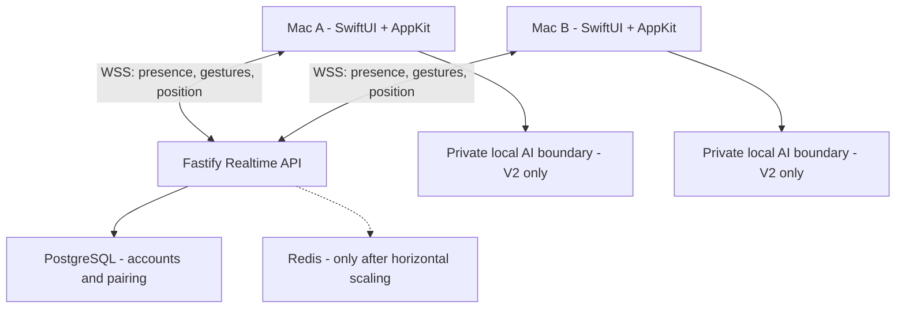

# Pair Companion for macOS
## Technical Architecture, Technology Stack, and AI-Agent Source of Truth

**Document status:** Authoritative technical baseline  
**Applies to:** V1 Dot MVP, V1.1 Pet Beta, and V2 Private AI Companion  
**Primary platform:** macOS  
**Last updated:** July 29, 2026  
**Related product plan:** `Pair_Companion_Product_Roadmap_V1_to_V2.md`  

---

## 1. Purpose of This Document

This document is the persistent technical source of truth for humans and AI coding agents working on Pair Companion.

It defines:

- the approved programming languages and frameworks;
- the client, server, database, animation, and AI architecture;
- boundaries between shared couples data and private AI data;
- the intended repository structure;
- event contracts and persistence rules;
- coding and testing standards;
- technologies that should not be introduced without approval;
- phase-specific implementation guidance; and
- the process for changing an architectural decision.

This document explains **what the project should use and why**. The product roadmap explains **what should be delivered and when**.

---

## 2. Instructions for AI Coding Agents

### 2.1 Authority

When implementing this project, treat this file as the default architecture unless:

1. the user explicitly requests a change;
2. an approved Architecture Decision Record, or ADR, supersedes a section; or
3. the existing repository already contains a newer documented decision.

### 2.2 Required behavior

Before modifying code, an AI agent should:

1. Read this file completely.
2. Read `Pair_Companion_Product_Roadmap_V1_to_V2.md`.
3. Inspect the current repository structure and dependency manifests.
4. Check for `AGENTS.md`, repository instructions, and ADRs.
5. Identify the current release phase: V1, V1.1, or V2.
6. Confirm that the requested feature belongs to that phase.
7. Preserve the privacy boundary defined in this document.
8. Avoid adding frameworks or infrastructure not required by the active milestone.

### 2.3 Dependency rule

Do not silently replace the approved stack.

If a different language, framework, database, networking library, or animation system is proposed, the agent must:

- explain the concrete problem with the current choice;
- compare at least two alternatives;
- describe migration and operational costs;
- identify privacy and security effects;
- create or update an ADR; and
- receive user approval before making the change.

### 2.4 Version rule

This document intentionally avoids hard-coding most dependency versions because they change.

Agents must:

- use the latest stable version compatible with the repository's supported macOS and runtime versions;
- inspect `Package.swift`, `Package.resolved`, `package.json`, and the lockfile before recommending an upgrade;
- pin dependencies through the appropriate lockfile;
- never select prerelease software for production code without an approved ADR;
- document the exact toolchain in the repository; and
- run tests before and after dependency upgrades.

### 2.5 Scope rule

Do not implement V2 AI permissions or screen capture while the project is still building the V1 Dot MVP unless the user explicitly changes the roadmap.

The V1 core must remain useful without:

- Screen Recording permission;
- Microphone permission;
- Accessibility permission;
- continuous screenshots;
- an AI model;
- Redis;
- Kafka;
- WebRTC; or
- a microservice architecture.

---

## 3. Final Stack Decision

### 3.1 Approved stack

| Product area | Approved language or technology | Framework or API |
|---|---|---|
| macOS application | Swift | SwiftUI + AppKit |
| Floating desktop overlay | Swift | AppKit `NSPanel` / `NSWindow` |
| Regular app interface | Swift | SwiftUI |
| Concurrency | Swift | Swift Concurrency: `async/await`, actors, structured tasks |
| Local application state | Swift | Observation framework or explicit observable models |
| V1 dot animation | Swift | SwiftUI animation and Core Animation |
| V1.1 character animation | Rive asset + Swift integration | Rive Apple runtime through Swift Package Manager |
| Realtime macOS client | Swift | Foundation `URLSessionWebSocketTask` |
| Backend | TypeScript | Fastify |
| Realtime backend | TypeScript | `@fastify/websocket` using native WebSockets |
| Runtime validation | TypeScript | Zod |
| Database | PostgreSQL | Prisma ORM |
| Temporary distributed state | Redis, later only | Add only when multiple backend instances require it |
| Local credential storage | Swift | macOS Keychain Services |
| V2 screen capture | Swift | ScreenCaptureKit |
| V2 voice input | Swift | AVFoundation |
| V2 local automation | Swift | macOS Accessibility APIs with explicit permission |
| V2 AI orchestration | TypeScript | Isolated backend module using provider SDK or HTTPS API |
| macOS unit/integration tests | Swift | Swift Testing; XCTest where required |
| Backend tests | TypeScript | Vitest and Fastify injection/test utilities |
| Packaging | Apple tooling | Developer ID signing, notarization, DMG |
| Application updates | Swift/macOS | Sparkle, introduced in V1.1 |
| Containerization | Infrastructure | Docker for backend and local PostgreSQL |
| CI | Repository dependent | GitHub Actions or the repository's approved equivalent |

### 3.2 Short version

> Use **Swift with SwiftUI and AppKit** for the macOS application. Use **TypeScript with Fastify and native WebSockets** for the server. Store durable account and pairing data in **PostgreSQL through Prisma**. Use native Swift animation for the dot and add **Rive** only when the final character work begins.

---

## 4. Why This Stack Was Selected

### 4.1 Why Swift is required

The hardest parts of this product are native macOS behaviors:

- a transparent floating window;
- click-through behavior outside the character;
- correct mouse hit testing;
- full-screen application support;
- macOS Spaces behavior;
- sleep, wake, lock, and idle signals;
- multi-display coordinate conversion;
- menu-bar controls;
- Keychain storage;
- Screen Recording permission;
- Accessibility permission; and
- signed and notarized distribution.

These behaviors are best implemented with Apple's native frameworks.

Using Electron, Flutter, React Native, Python, or a browser wrapper would not remove the Swift work. It would add a bridge layer around the hardest native functionality.

### 4.2 Why SwiftUI and AppKit are combined

SwiftUI should implement:

- onboarding;
- account and pairing screens;
- emotion picker;
- settings;
- privacy explanations;
- mute and snooze controls;
- display proxy interface;
- menu-bar content; and
- standard alerts and confirmation dialogs.

AppKit should implement:

- the transparent overlay window;
- `NSPanel` lifecycle;
- non-activating window behavior;
- click-through regions;
- full-screen and Spaces collection behavior;
- fine-grained window level;
- display geometry;
- local event handling where SwiftUI is insufficient; and
- integration between the overlay and native system events.

Apple explicitly supports integrating SwiftUI and AppKit. Do not force the overlay into a pure SwiftUI architecture if doing so weakens window control.

### 4.3 Why TypeScript and Fastify are used for the server

The backend is a small realtime coordination service. It needs:

- HTTP endpoints for authentication and pairing;
- WebSocket upgrade routes;
- connection authentication;
- schema validation;
- pair authorization;
- rate limiting;
- heartbeat tracking;
- current-state reconciliation;
- PostgreSQL access;
- structured logging; and
- a clean path to AI-provider integration in V2.

Fastify is preferred over a larger framework because:

- it is lightweight;
- route behavior remains visible;
- it works well with TypeScript;
- its WebSocket plugin uses native WebSockets;
- it is easier to learn than a heavily decorated framework;
- it supports request validation and plugins;
- it is sufficient for the expected system size; and
- it does not force a microservice architecture.

### 4.4 Why NestJS is not the default

NestJS is a valid alternative for a larger backend team. It provides modules, dependency injection, guards, interceptors, and WebSocket gateways.

It is not the default because:

- the initial service is small;
- decorators can hide connection behavior from a learner;
- it adds more structure than V1 needs; and
- Fastify provides the required capabilities with less framework surface.

Move to NestJS only if the backend grows enough that its module and dependency-injection structure solves an observed problem.

### 4.5 Why PostgreSQL and Prisma are used

PostgreSQL stores durable data with clear relational constraints:

- users;
- devices;
- pair relationships;
- invite codes;
- token or session records;
- user preferences that must roam; and
- release-safe migrations.

Prisma is selected because:

- its schema is readable;
- it produces a typed TypeScript client;
- migrations are explicit;
- PostgreSQL support is mature; and
- it makes common account and pairing queries straightforward.

### 4.6 Why Redis is deferred

Redis is not required for one backend instance.

Add Redis only when at least one of these becomes true:

- WebSocket clients are distributed across multiple API instances;
- presence must be shared between server instances;
- a pub/sub channel is required for cross-instance delivery;
- distributed rate limits are required;
- short-lived queues must survive an individual instance restart; or
- measured load demonstrates an actual need.

Do not introduce Redis simply because realtime applications often use it.

### 4.7 Why raw WebSockets are used

Use standard secure WebSockets, `wss://`, for:

- presence changes;
- heartbeats;
- display geometry;
- character movement;
- emotional gestures;
- delivery receipts;
- acknowledgments; and
- pair revocation.

Do not use WebRTC in V1. The product does not need peer-to-peer audio, video, or unreliable datagrams. A server relay is simpler for:

- authentication;
- ownership enforcement;
- rate limiting;
- acknowledgment;
- revocation;
- reconnect behavior; and
- debugging.

Do not use Socket.IO unless the product develops a concrete requirement for its additional protocol behavior. Native WebSockets keep the Swift client simpler and make the event protocol explicit.

---

## 5. System Architecture



### 5.1 Data planes

The architecture has two separate data planes.

#### Shared couples plane

May contain only:

- coarse presence state;
- character identity;
- normalized position;
- display geometry without pixels or window information;
- emote identifier;
- delivery status;
- acknowledgment;
- connection heartbeat;
- pair membership; and
- short-lived ordering metadata.

#### Private AI plane

May contain:

- current screenshot after explicit invocation;
- voice input after explicit invocation;
- the user's private AI request;
- private AI response;
- temporary private session summary;
- local UI-element coordinates; and
- proposed local action.

The private AI plane must never write directly to the shared couples plane.

---

## 6. macOS Application Architecture

### 6.1 Recommended modules

| Module | Responsibility |
|---|---|
| `AppShell` | Application lifecycle, dependency construction, environment |
| `OverlayWindow` | `NSPanel`, window level, Spaces, full-screen, hit testing |
| `CompanionRenderer` | Dot or Rive character rendering and animation |
| `PresenceEngine` | Sleep, wake, lock, idle, hysteresis, local state |
| `RealtimeClient` | WebSocket connection, reconnect, heartbeats, event routing |
| `PairingFeature` | Account session, invite creation, invite acceptance, unpair |
| `PositioningFeature` | Display geometry, proxy, coordinate normalization, interpolation |
| `EmotionFeature` | Emote selection, local preview, send, receive, acknowledgment |
| `ReceiverControls` | Mute, snooze, quiet hours, presentation mode |
| `PrivacyCenter` | Permission status, data explanations, clear/reset actions |
| `SecureStorage` | Keychain wrapper for device and session secrets |
| `Diagnostics` | Privacy-safe logs, performance counters, support export |
| `PrivateAI`, V2 | Capture, microphone, AI session, local action proposals |

### 6.2 App-layer boundaries

Use a feature-oriented architecture with clear platform adapters.

Recommended dependency direction:

```text
SwiftUI Features
      ↓
Domain Models and Use Cases
      ↓
Service Protocols
      ↓
AppKit / Network / Keychain / Database Adapters
```

Rules:

- SwiftUI views should not open WebSocket connections directly.
- `NSPanel` code should not contain backend business rules.
- Event decoding should not change UI state without passing through a typed event router.
- Keychain calls should be behind a small protocol.
- Presence sensors should produce domain states, not directly send network packets.
- Rendering should consume state; it should not decide account or privacy policy.

### 6.3 State ownership

Use actors or main-actor-isolated models intentionally:

- UI-observed state should be `@MainActor`.
- WebSocket receive loops should run outside the main actor.
- Connection state should be isolated in an actor.
- Presence calculations should be deterministic and testable.
- Animation updates must be marshaled to the main actor.
- Avoid unstructured detached tasks unless a documented reason exists.

### 6.4 Overlay window requirements

The overlay implementation should support:

- transparent background;
- no standard title bar;
- non-activating interaction;
- floating level;
- all Spaces;
- full-screen auxiliary behavior;
- click-through outside active character bounds;
- draggable owned character;
- safe screen clamping;
- menu-bar escape controls;
- presentation-mode suppression; and
- restoration after display topology changes.

The overlay must not:

- steal keyboard focus during normal movement;
- block clicks outside the character;
- trap the character offscreen;
- reveal private state through window title or accessibility text; or
- appear during presentation mode.

### 6.5 V1 dot rendering

Use native SwiftUI animation or Core Animation.

The dot must support:

- idle;
- active;
- away;
- sleeping;
- unavailable;
- ten emotional expressions;
- ownership differentiation;
- movement interpolation;
- Reduce Motion alternatives; and
- color-independent identity cues.

Do not add Rive to the project until the V1 interaction system is stable unless the user explicitly changes the plan.

### 6.6 V1.1 Rive rendering

When V1.1 begins:

- install Rive through Swift Package Manager;
- keep the animation state contract independent of Rive;
- map domain states to Rive state-machine inputs;
- retain the dot renderer as a debug and fallback implementation;
- keep accessible controls in native SwiftUI;
- profile CPU, memory, and energy use; and
- do not place essential buttons or labels only inside the Rive canvas.

---

## 7. Realtime Protocol

### 7.1 Transport

- Protocol: secure WebSocket, `wss://`
- Payload: JSON during V1 and V1.1
- Encoding: UTF-8
- Authentication: short-lived access token during WebSocket upgrade
- Event version: required
- Connection heartbeat: application-level heartbeat plus protocol ping/pong where appropriate
- Ordering: monotonically increasing sequence numbers per logical stream

JSON is intentionally selected because:

- events are easy to inspect;
- contract fixtures are readable;
- payload volume is small;
- protocol bugs are easier to diagnose; and
- optimization is not currently necessary.

Do not move to Protocol Buffers or MessagePack without measurements and an ADR.

### 7.2 Event envelope

Every WebSocket event should follow one common envelope.

```json
{
  "version": 1,
  "type": "presence.updated",
  "eventId": "opaque-unique-id",
  "pairId": "opaque-pair-id",
  "actorId": "opaque-user-id",
  "deviceId": "opaque-device-id",
  "sequence": 42,
  "sentAt": "2026-07-29T20:00:00Z",
  "payload": {}
}
```

Rules:

- `eventId` is used for deduplication.
- `pairId` is authorized server-side; never trust it because the client sent it.
- `actorId` is derived from authentication when possible.
- `sequence` is scoped and documented per event stream.
- `sentAt` is used for expiry and ordering, not for partner-visible timestamps.
- `payload` is validated by event type.
- Unknown versions and unsupported event types must fail safely.

### 7.3 Approved V1 event types

| Event type | Direction | Durable? | Purpose |
|---|---|---:|---|
| `session.ready` | Server to client | No | Confirms authenticated realtime session |
| `heartbeat` | Client to server | No | Indicates connection health |
| `presence.updated` | Bidirectional relay | Current state only | Shares coarse presence |
| `display.geometry` | Bidirectional relay | Session only | Shares geometry without screen contents |
| `drag.started` | Bidirectional relay | No | Starts owned-character movement lease |
| `position.updated` | Bidirectional relay | No | Sends normalized movement |
| `drag.ended` | Bidirectional relay | Final state optional | Ends movement session |
| `emote.sent` | Bidirectional relay | Short TTL | Sends deliberate emotional gesture |
| `emote.delivered` | Bidirectional relay | Short TTL | Confirms receiver accepted event |
| `emote.deferred` | Bidirectional relay | Short TTL | Indicates local interruption policy deferred it |
| `emote.acknowledged` | Bidirectional relay | Session only | Explicit receiver acknowledgment |
| `emote.expired` | Server to sender | No | Indicates TTL ended |
| `pair.revoked` | Server to clients | Pair record updated | Ends shared access |
| `error` | Server to client | No | Typed protocol error |

### 7.4 Validation

The TypeScript server must validate every incoming payload with Zod.

The Swift client must decode into typed `Codable` structures.

Maintain shared contract fixtures:

```text
protocol/
├── fixtures/
│   ├── valid/
│   └── invalid/
├── schemas/
└── README.md
```

Both Swift and TypeScript test suites must consume the same fixtures.

### 7.5 Position-update behavior

- Send normalized `x` and `y` values between `0` and `1`.
- Use the receiving display's visible frame.
- Include a short-lived drag session ID.
- Accept writes only from the character owner.
- Coalesce outgoing updates to approximately 20-30 Hz.
- Render at display frame rate through local interpolation.
- Do not persist live position packets.
- Persist only the final position if the product requires position restoration.
- Discard out-of-order or expired packets.
- Clamp the complete character to safe visible bounds.

### 7.6 Reconnect behavior

On reconnect:

1. Authenticate again.
2. Establish the new session.
3. Request or receive the latest canonical current state.
4. Discard expired gestures.
5. Do not replay old position packets.
6. Reconcile the latest final position.
7. Restart heartbeat.
8. Update local UI without falsely indicating acknowledgment.

---

## 8. Backend Architecture

### 8.1 Recommended Fastify modules

```text
src/
├── app.ts
├── server.ts
├── config/
├── plugins/
│   ├── auth.ts
│   ├── database.ts
│   ├── websocket.ts
│   ├── rate-limit.ts
│   └── logging.ts
├── modules/
│   ├── health/
│   ├── users/
│   ├── devices/
│   ├── pairing/
│   ├── sessions/
│   ├── realtime/
│   ├── presence/
│   ├── gestures/
│   └── private-ai/
├── protocol/
├── security/
└── tests/
```

### 8.2 Backend responsibilities

The backend is responsible for:

- account and device authentication;
- short-lived invite-code creation;
- invite-code attempt limits and expiration;
- pair membership;
- token revocation;
- WebSocket upgrade authentication;
- connection registry;
- ownership validation;
- event schema validation;
- event routing;
- rate limiting;
- server-derived unavailable state;
- short-lived event expiry;
- current-state reconciliation; and
- privacy-safe operational logging.

The backend is not responsible for:

- rendering animation;
- deciding local Focus mode names;
- collecting screen contents for the couples experience;
- storing detailed relationship history;
- storing continuous positions;
- remote desktop control; or
- silently composing partner messages from AI context.

### 8.3 Connection registry

For one backend instance, maintain active connections in memory:

```text
pairId
  ├── userA
  │     └── active device connections
  └── userB
        └── active device connections
```

When horizontal scaling is introduced:

- retain local socket objects in each process;
- use Redis pub/sub for cross-instance routing;
- store presence leases with expiration;
- use distributed rate limits where necessary; and
- do not attempt to serialize socket objects into Redis.

### 8.4 Rate limits

Apply separate policies for:

- invite-code creation;
- invite-code attempts;
- authentication attempts;
- WebSocket connections;
- deliberate gestures;
- drag-session creation;
- position updates;
- acknowledgment events; and
- V2 AI requests.

Rate limits should protect users and infrastructure without exposing the receiver's private mute reason.

### 8.5 Logging rules

Log:

- request ID;
- event type;
- result category;
- connection lifecycle;
- latency;
- schema failure category;
- authorization failure category;
- server error; and
- aggregate performance data.

Do not log:

- screenshots;
- microphone content;
- full AI prompts by default;
- exact character message content if future free text is introduced;
- tokens;
- invite codes;
- Keychain values;
- detailed screen geometry tied to permanent hardware identity; or
- unredacted sensitive request payloads.

---

## 9. Database Design

### 9.1 Initial PostgreSQL entities

| Entity | Purpose |
|---|---|
| `User` | Account identity |
| `Device` | Registered Mac and public device identity |
| `Pair` | Two-person relationship |
| `PairMember` | Membership and role constraints |
| `Invite` | Short-lived one-time pairing code |
| `Session` | Refresh or device-session metadata |
| `RevokedToken` or token version | Immediate revocation support |
| `UserPreference` | Only preferences that should roam |
| `FinalCharacterPosition`, optional | Last normalized position when persistence is enabled |

### 9.2 Data not stored by default

Do not create durable tables for:

- minute-by-minute presence;
- exact last-seen history visible to partners;
- all position updates;
- all gestures;
- read receipts over time;
- screenshots;
- app names;
- window titles;
- clipboard contents;
- typed text;
- microphone recordings; or
- AI session content.

If future product requirements introduce any of these, a privacy review and ADR are required.

### 9.3 Pair constraints

The database must enforce:

- exactly two active members per pair;
- a user belongs to no more than the allowed number of active pairs;
- an invite is one-time and expiring;
- revoked pairs cannot create new realtime sessions;
- device ownership is explicit;
- character ownership maps to one user; and
- deleted or revoked credentials cannot regain access.

### 9.4 Migration policy

- All schema changes use Prisma migrations.
- Never modify production schema manually.
- Migrations must be reviewed.
- Destructive migrations require a backup and rollback plan.
- Seed data must contain no real user information.
- Tests should create isolated databases or schemas.

---

## 10. Authentication and Pairing

### 10.1 Recommended approach

Use a standards-based account identity such as Sign in with Apple when the product reaches external testing.

For early local development:

- use a clearly marked development identity provider;
- never ship development bypass authentication;
- store device secrets in Keychain;
- issue short-lived access tokens;
- rotate refresh credentials; and
- authenticate the WebSocket upgrade.

### 10.2 Invite-code flow

1. User A requests an invite.
2. Server creates a high-entropy, short-lived, one-time invite.
3. User A shares the human-entered code or link.
4. User B authenticates and submits the invite.
5. Server validates expiration, attempt limit, and unused state.
6. Server creates the pair transactionally.
7. Invite is consumed.
8. Both active clients receive pair-ready state.

### 10.3 Pairing security

- Do not derive invite security from a short visible code alone.
- Back visible codes with a high-entropy server token when links are used.
- Apply attempt limits.
- Expire invitations quickly.
- Prevent invitation reuse.
- Do not reveal whether an arbitrary user account exists.
- Record security events without storing the secret.
- Unpairing must revoke active shared sessions.

---

## 11. V2 Private AI Architecture

### 11.1 Technology

Use:

- ScreenCaptureKit for explicit screen capture;
- AVFoundation for explicit push-to-talk;
- native Accessibility APIs only for approved local automation;
- the existing TypeScript backend for model-provider calls and key protection;
- a provider interface so the model can be changed; and
- optional future on-device inference through Core ML when justified.

### 11.2 Invocation policy

AI screen context must be:

- initiated by an explicit hotkey, button, or push-to-talk action;
- accompanied by a visible capture indicator;
- scoped to the current request;
- clearable by the user;
- excluded from partner events; and
- disabled without breaking V1 features.

No continuous screenshot timer is permitted.

### 11.3 AI backend boundary

Use a separate module and endpoint namespace:

```text
/v1/private-ai/*
```

This module must not import the couples realtime event publisher directly.

If a user wants to share an AI result:

1. AI returns the private answer.
2. Client opens a separate compose screen.
3. User reviews or edits the content.
4. User explicitly confirms send.
5. A normal shared event is created without private metadata.

### 11.4 API-key policy

Never embed model-provider secrets in the macOS application.

Store provider credentials in:

- deployment secret management;
- protected environment configuration; or
- an approved managed-secret service.

Never:

- commit `.env` files;
- print secrets in logs;
- send provider credentials to the client; or
- ask users to paste production credentials into ordinary app settings unless bring-your-own-key becomes an explicitly designed feature.

### 11.5 Initial AI actions

The first V2 actions should be narrow:

| Capability | Initial status |
|---|---|
| Explain visible screen | Allowed |
| Summarize visible error | Allowed |
| Point to UI element | Allowed locally |
| Suggest next step | Allowed |
| Open explicitly named local app | Confirmation required |
| Open a settings pane | Confirmation required |
| Fill a non-sensitive local field | Later; confirmation required |
| Send email or message | Not initially allowed |
| Make purchase | Not allowed |
| Enter credential | Not allowed |
| Delete user data | Not allowed |

### 11.6 Prompt-injection defense

Treat all screen text as untrusted content.

The model must not:

- follow instructions merely because they appear on screen;
- broaden the approved action allowlist;
- bypass confirmation;
- expose system prompts or secrets;
- transfer screen content to the partner; or
- interpret a webpage's instruction as user authorization.

Authorization is determined by product code, not model output.

---

## 12. Security and Privacy Requirements

### 12.1 Core requirements

- Use TLS for all HTTP and WebSocket traffic.
- Authenticate every connection.
- Authorize every pair-scoped event.
- Validate character ownership.
- Validate every payload.
- Rate-limit abuse-sensitive operations.
- Store secrets in Keychain or server secret management.
- Separate durable and ephemeral data.
- Support immediate pair revocation.
- Minimize logs.
- Test that AI data cannot enter partner events.

### 12.2 Permission progression

| Release | Screen Recording | Microphone | Accessibility |
|---|---:|---:|---:|
| V1 Dot MVP | Not required | Not required | Not required |
| V1.1 Pet Beta | Not required | Not required | Not required |
| V2 read-only screen help | Explicit opt-in | Optional, explicit | Not required |
| V2 push-to-talk | Explicit opt-in | Explicit opt-in | Not required |
| V2 approved automation | Explicit when screen context is used | Optional | Explicit and contextual |

### 12.3 Privacy invariant

The following automated test must always remain conceptually true:

```text
For every partner-bound event:
    payload contains no screenshot bytes
    payload contains no OCR text
    payload contains no AI prompt
    payload contains no AI response
    payload contains no window title
    payload contains no application name
    payload contains no clipboard content
```

---

## 13. Recommended Repository Structure

```text
pair-companion/
├── AGENTS.md
├── README.md
├── Pair_Companion_Product_Roadmap_V1_to_V2.md
├── Pair_Companion_Technical_Architecture.md
├── apps/
│   └── macos/
│       ├── PairCompanion.xcodeproj
│       ├── PairCompanion/
│       │   ├── App/
│       │   ├── Domain/
│       │   ├── Features/
│       │   ├── Platform/
│       │   ├── Networking/
│       │   ├── Rendering/
│       │   ├── Resources/
│       │   └── Privacy/
│       ├── PairCompanionTests/
│       └── PairCompanionUITests/
├── services/
│   └── realtime-api/
│       ├── src/
│       ├── tests/
│       ├── prisma/
│       ├── package.json
│       ├── tsconfig.json
│       └── Dockerfile
├── protocol/
│   ├── README.md
│   ├── schemas/
│   └── fixtures/
│       ├── valid/
│       └── invalid/
├── infrastructure/
│   ├── compose.yaml
│   ├── deployment/
│   └── monitoring/
├── docs/
│   ├── adr/
│   ├── privacy/
│   ├── testing/
│   └── releases/
└── scripts/
```

### 13.1 Monorepo guidance

Use one repository initially because:

- client and server protocol changes are coordinated;
- contract fixtures remain together;
- documentation stays close to implementation;
- one learner or small team can navigate the system;
- CI can run cross-language contract tests; and
- release history is easier to understand.

Split repositories only when organizational ownership or release independence creates a measurable need.

---

## 14. Environment Configuration

### 14.1 Backend environment variables

Expected categories:

```text
APP_ENV
HTTP_HOST
HTTP_PORT
DATABASE_URL
ACCESS_TOKEN_SECRET_OR_KEY_REFERENCE
REFRESH_TOKEN_SECRET_OR_KEY_REFERENCE
INVITE_TOKEN_SECRET_OR_KEY_REFERENCE
ALLOWED_ORIGINS
LOG_LEVEL
REDIS_URL                    # Only after Redis is introduced
AI_PROVIDER                  # V2 only
AI_PROVIDER_API_KEY          # V2 only, server-side secret
AI_REQUEST_BUDGET            # V2 only
```

Rules:

- Commit `.env.example`, never `.env`.
- Use obviously fake values in examples.
- Validate required configuration on startup.
- Fail closed when security configuration is missing.
- Separate development, test, staging, and production.

### 14.2 macOS configuration

The macOS application should receive:

- API base URL;
- WebSocket base URL;
- release channel;
- feature flags;
- build identifier; and
- supported protocol version.

Do not place server secrets in application configuration.

---

## 15. Coding Standards

### 15.1 Swift standards

- Enable strict concurrency checking appropriate to the toolchain.
- Prefer value types for domain events.
- Use enums for finite states.
- Use `Codable` for network payloads.
- Isolate UI state to `@MainActor`.
- Use actors for connection and mutable concurrent state.
- Avoid force unwraps in production paths.
- Avoid singleton service locators.
- Use dependency injection through explicit initializers.
- Keep AppKit adapters small.
- Keep privacy-sensitive code easy to audit.
- Use structured logging with redaction.
- Add doc comments to protocol and privacy boundaries.

### 15.2 TypeScript standards

- Enable strict TypeScript mode.
- Do not use `any` in protocol or security code.
- Validate external data with Zod.
- Infer internal types from schemas where practical.
- Keep route handlers thin.
- Put authorization in reusable services or hooks.
- Use typed domain errors.
- Never trust client-supplied identity or pair membership.
- Make event routing deterministic.
- Use dependency injection through Fastify plugins or explicit constructors.
- Keep model-provider code isolated in V2.

### 15.3 API standards

- Version HTTP routes and WebSocket event envelopes.
- Use stable machine-readable error codes.
- Do not expose stack traces to clients.
- Use request IDs.
- Define timeout and retry behavior.
- Make idempotency explicit for retryable operations.
- Document all durable side effects.

---

## 16. Testing Strategy

### 16.1 Test pyramid

| Test level | Purpose |
|---|---|
| Unit tests | State machines, coordinate conversion, schema rules, rate limits |
| Contract tests | Same valid and invalid event fixtures in Swift and TypeScript |
| Integration tests | Fastify routes, PostgreSQL, WebSocket authentication |
| Component tests | Overlay behavior, rendering-state mapping, reconnect logic |
| End-to-end tests | Pairing and communication between two clients |
| Privacy tests | Prove forbidden fields cannot enter partner events |
| Fault-injection tests | Delay, packet loss, reorder, disconnect, sleep, wake |
| Release tests | Signing, notarization, installation, update, rollback |

### 16.2 Required V1 unit tests

- Presence-state entry and exit conditions.
- Hysteresis and minimum dwell.
- Heartbeat expiration.
- Coordinate normalization.
- AppKit/Core Graphics origin conversion.
- Safe-frame clamping.
- Position sequence rejection.
- Drag-session expiry.
- Character ownership validation.
- Gesture TTL.
- Rate-limit behavior.
- Pair revocation.
- Unknown event-version rejection.

### 16.3 Required privacy tests

- Partner event schemas have no private AI fields.
- Unexpected fields are rejected or removed according to documented policy.
- Logs redact authentication and invite secrets.
- Screen-capture objects cannot be serialized into shared events.
- AI module cannot publish directly through the couples event router.
- User denial of AI permissions does not break pairing or presence.

### 16.4 Test environments

At minimum test:

- two physical Macs;
- different display resolutions;
- one and multiple displays;
- different scaling settings;
- multiple Spaces;
- full-screen applications;
- sleep and wake;
- lock and unlock;
- Wi-Fi loss and reconnect;
- high latency;
- packet loss;
- reordered packets; and
- supported accessibility settings.

---

## 17. Development and Deployment

### 17.1 Local development

Recommended local components:

```text
macOS client: Xcode
backend: current Node.js LTS
package manager: repository-selected npm, pnpm, or yarn; choose one
database: PostgreSQL in Docker
Redis: absent until required
```

Do not require Docker for the macOS application itself.

### 17.2 Backend deployment

Deploy the Fastify service as a long-running container or server process that supports persistent WebSocket connections.

The hosting environment must support:

- WebSocket upgrades;
- idle connection duration appropriate for the app;
- TLS;
- health checks;
- rolling deployment behavior;
- connection draining;
- PostgreSQL connectivity;
- secret injection; and
- structured log collection.

Avoid platforms that terminate long-lived WebSocket connections unpredictably unless their behavior is explicitly handled.

### 17.3 macOS distribution

The intended distribution path is:

1. stable bundle identifier;
2. Developer ID signing;
3. notarization;
4. signed DMG;
5. private alpha distribution;
6. Sparkle signed update feed in V1.1; and
7. documented rollback process.

Do not validate macOS permissions using unsigned throwaway executables as a substitute for the actual app bundle.

### 17.4 CI checks

CI should run:

- Swift build;
- Swift unit tests;
- TypeScript type check;
- backend lint;
- backend unit and integration tests;
- protocol contract fixtures;
- Prisma migration validation;
- secret scanning;
- dependency audit;
- privacy-boundary tests; and
- build-artifact checks appropriate to the branch.

Signing and notarization should run only in protected release workflows.

---

## 18. Phase-Specific Technology Plan

### 18.1 V1 Dot MVP

Use:

- Swift;
- SwiftUI;
- AppKit;
- native dot animation;
- `URLSessionWebSocketTask`;
- TypeScript;
- Fastify;
- `@fastify/websocket`;
- Zod;
- PostgreSQL;
- Prisma;
- Keychain; and
- Docker for local backend dependencies.

Do not use:

- Rive unless an approved early spike is needed;
- Redis;
- WebRTC;
- AI;
- ScreenCaptureKit;
- Accessibility automation;
- continuous screen observation; or
- microservices.

### 18.2 V1.1 Pet Beta

Add:

- Rive Apple runtime or the approved animation alternative;
- final character assets;
- multi-display behavior;
- Sparkle;
- stronger diagnostics;
- expanded release automation; and
- Redis only if horizontal scaling is actually introduced.

### 18.3 V2 Private AI Companion

Add:

- ScreenCaptureKit;
- AVFoundation push-to-talk;
- private AI backend module;
- model-provider abstraction;
- explicit context retention controls;
- local UI pointing;
- optional Accessibility automation;
- action allowlist;
- confirmation policies;
- AI cost budgets; and
- prompt-injection and safety tests.

---

## 19. Technologies Not Approved by Default

| Technology | Default decision | Reason |
|---|---|---|
| Electron | Do not use | Native overlay and permission work still requires Swift; higher runtime overhead |
| Flutter | Do not use for the primary macOS app | Adds a bridge around native macOS requirements |
| React Native macOS | Do not use | Native integration remains the difficult part |
| Python desktop UI | Do not use | Weak fit for signed native overlay and macOS lifecycle |
| Pure SwiftUI overlay | Do not force | AppKit provides required low-level window control |
| WebRTC | Do not use in V1 | NAT and peer-to-peer complexity is unnecessary |
| Socket.IO | Do not use by default | Native WebSocket protocol is sufficient |
| Firebase/Supabase realtime as the complete transport | Do not use by default | Hides protocol behavior the project intends to learn and control |
| Redis | Defer | Unnecessary for a single backend instance |
| Kafka | Do not use | Far beyond the scale and delivery requirements |
| Kubernetes | Do not use initially | Operational complexity without a demonstrated need |
| Multiple backend microservices | Do not use initially | Pairing and realtime delivery belong in one deployable service |
| Continuous AI screenshots | Prohibited | Violates cost, privacy, and trust principles |
| API keys in the Mac app | Prohibited | Secrets can be extracted |
| Detailed presence history | Prohibited by default | Converts presence into monitoring |

---

## 20. Architecture Decision Records

Store ADRs in:

```text
docs/adr/
```

Naming:

```text
0001-swiftui-appkit-macos-client.md
0002-fastify-websocket-backend.md
0003-postgresql-prisma-persistence.md
0004-rive-animation-runtime.md
```

ADR template:

```markdown
# ADR-NNNN: Decision title

## Status
Proposed / Accepted / Superseded / Rejected

## Context
What problem requires a decision?

## Decision
What will the project do?

## Alternatives considered
What other options were evaluated?

## Consequences
What becomes easier, harder, or constrained?

## Privacy and security effect
Does this change data, permissions, or trust boundaries?

## Migration plan
How will the change be introduced or reversed?

## Approval
Who approved it and when?
```

---

## 21. Initial ADR Decisions

### ADR-0001: Native macOS client

**Status:** Accepted  
**Decision:** Use Swift with SwiftUI and AppKit.  
**Reason:** The application depends on native windowing, display, lifecycle, permission, and distribution behavior.

### ADR-0002: AppKit overlay

**Status:** Accepted  
**Decision:** Implement the floating character through an AppKit `NSPanel` or appropriate `NSWindow` subclass, hosting SwiftUI content where useful.  
**Reason:** The overlay requires lower-level control than a standard SwiftUI window.

### ADR-0003: Fastify backend

**Status:** Accepted  
**Decision:** Use TypeScript with Fastify and `@fastify/websocket`.  
**Reason:** The backend is small, realtime, typed, and benefits from visible protocol behavior.

### ADR-0004: Native WebSocket protocol

**Status:** Accepted  
**Decision:** Use secure standard WebSockets with JSON event envelopes.  
**Reason:** The system needs low-latency bidirectional events without WebRTC or Socket.IO complexity.

### ADR-0005: PostgreSQL and Prisma

**Status:** Accepted  
**Decision:** Persist accounts, devices, pairing, invitations, and sessions in PostgreSQL through Prisma.  
**Reason:** The data is relational and benefits from typed migrations and constraints.

### ADR-0006: Native dot before Rive

**Status:** Accepted  
**Decision:** Use native Swift animation for V1. Evaluate or introduce Rive in V1.1.  
**Reason:** Product behavior should be validated before final animation investment.

### ADR-0007: Private AI isolation

**Status:** Accepted  
**Decision:** V2 AI context is private and cannot directly enter partner-bound events.  
**Reason:** Shared screen context would damage trust and create a surveillance risk.

---

## 22. Implementation Order

The first technical milestones should be completed in this order:

1. Create the signed macOS app shell.
2. Build the transparent `NSPanel` overlay.
3. Render two local dots.
4. Implement click-through and own-dot dragging.
5. Implement the local presence state machine.
6. Build Fastify and WebSocket loopback server.
7. Define versioned event envelopes and fixtures.
8. Add authentication and pairing.
9. Synchronize presence.
10. Add display geometry and final positioning.
11. Add live drag interpolation.
12. Add emotional gestures and acknowledgment.
13. Add receiver controls and privacy tests.
14. Sign, notarize, and ship the V1 alpha.
15. Add final animation runtime in V1.1.
16. Begin V2 only after the roadmap gate passes.

---

## 23. First Repository Tasks for an AI Agent

When the repository is first created, the agent should produce:

- [ ] Root `README.md`.
- [ ] Root `AGENTS.md` pointing to this document and the roadmap.
- [ ] `apps/macos/` Xcode project.
- [ ] Stable macOS bundle identifier.
- [ ] `services/realtime-api/` Fastify TypeScript project.
- [ ] Strict TypeScript configuration.
- [ ] PostgreSQL and Prisma development configuration.
- [ ] `protocol/` directory with event-envelope specification.
- [ ] First valid and invalid contract fixtures.
- [ ] Docker Compose configuration for local PostgreSQL.
- [ ] CI for Swift and TypeScript checks.
- [ ] `docs/adr/` with the initial decisions.
- [ ] Secret-safe `.gitignore` and `.env.example`.
- [ ] Initial privacy test that forbids screen-context fields in partner events.

The first working demo should show:

1. a signed macOS app;
2. two animated dots in an overlay;
3. a local state simulator;
4. click-through behavior; and
5. no networking or AI yet.

---

## 24. Definition of Technical Completion

The stack is considered successfully implemented when:

- the native overlay behaves correctly across supported macOS environments;
- two authenticated users can pair;
- presence, movement, gestures, delivery, and acknowledgment work through secure WebSockets;
- stale and unauthorized events are rejected;
- the application recovers from sleep and network loss;
- the character never becomes permanently lost offscreen;
- the receiver can mute, defer, hide, or unpair;
- partner events contain no screen or AI context;
- durable data is limited to the approved PostgreSQL entities;
- the build is signed and notarized;
- tests enforce protocol, ownership, and privacy rules; and
- V2 permissions remain optional and isolated.

---

## 25. Official Technical References

### Apple

- [SwiftUI](https://developer.apple.com/documentation/swiftui)
- [SwiftUI and AppKit integration](https://developer.apple.com/documentation/swiftui/appkit-integration)
- [NSPanel](https://developer.apple.com/documentation/appkit/nspanel)
- [URLSessionWebSocketTask](https://developer.apple.com/documentation/foundation/urlsessionwebsockettask)
- [ScreenCaptureKit](https://developer.apple.com/documentation/screencapturekit)
- [Keychain Services](https://developer.apple.com/documentation/security/keychain-services)

### Backend

- [Fastify WebSocket plugin](https://github.com/fastify/fastify-websocket)
- [NestJS WebSocket gateways, alternative framework reference](https://docs.nestjs.com/websockets/gateways)
- [Vapor WebSockets, single-language alternative reference](https://docs.vapor.codes/advanced/websockets/)

### Database

- [Prisma with PostgreSQL](https://www.prisma.io/docs/prisma-orm/quickstart/postgresql)

### Animation

- [Rive Apple runtime](https://rive.app/docs/runtimes/apple/apple)

---

## 26. Change Log

| Version | Date | Change |
|---|---|---|
| 1.0 | July 29, 2026 | Established Swift/SwiftUI/AppKit client, TypeScript/Fastify backend, PostgreSQL/Prisma persistence, phased animation, and private V2 AI architecture |
